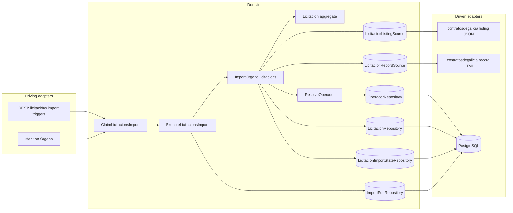
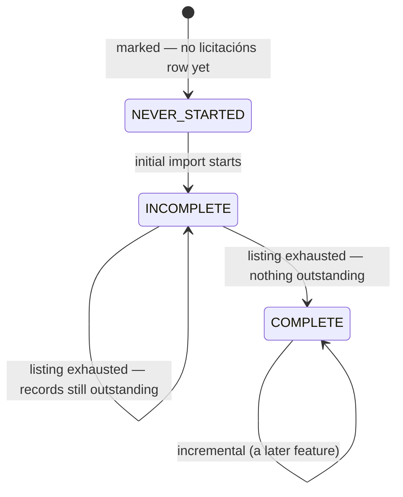
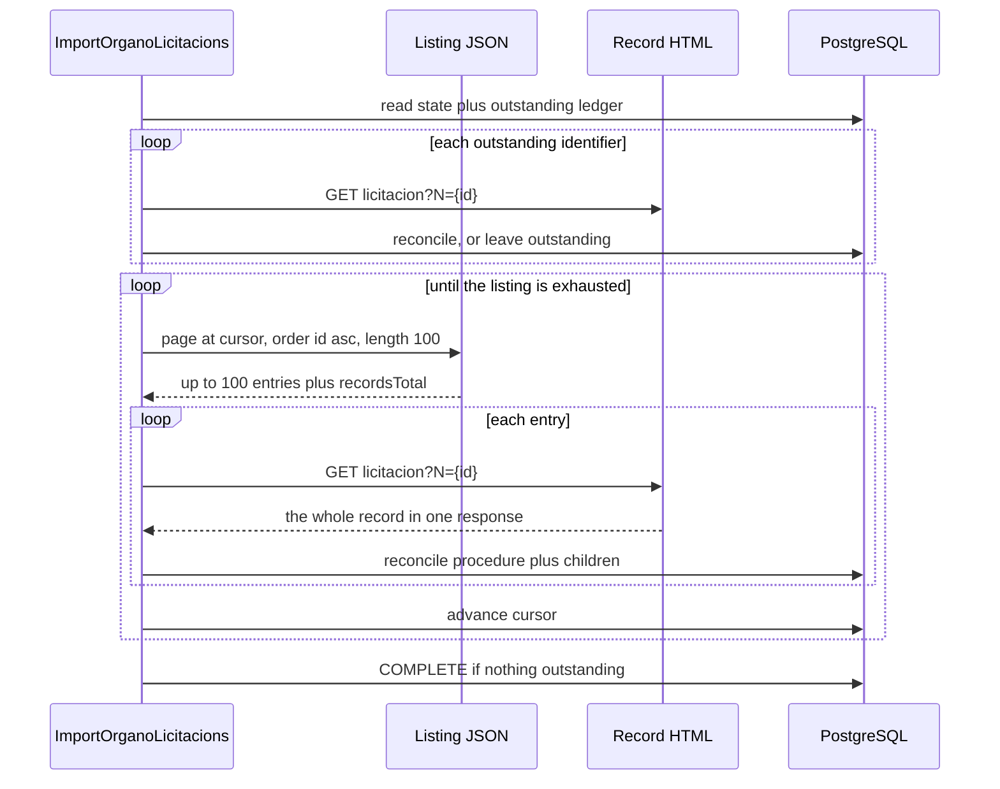

# FEAT-0015. Licitacións: the initial import and the stored procedure

## Goal

Make an Órgano's **licitacións** loadable: the system retrieves each marked Órgano's full
published tender history from contratosdegalicia.gal — the listing, and then **one record per
procedure** — and stores each procedure whole, with its lotes, classifications, bidders and
awards. This is the first buildable slice of
**[SPEC-0008](../../specs/SPEC-0008-import-browse-licitacions.md)**.

It delivers R3–R8 (R7 and R8 as *storage* obligations — every display obligation is the browsing
feature's); the **initial** and **resumed** modes of R9; the on-demand half of R10; R13's
reconciliation and R14's idempotence; the storage halves of R16 and R18, and **as much of R17's as
the source permits** (see *What this feature needs*); R27's triggers, including the mark that
requests both families in order; R29's guard, **but not its yielding**; R30's two-level failure
isolation; and R33's as-published rule.

It exposes **no licitación read endpoint**. Nothing browses licitacións until the browsing feature
builds the family split, the year scoping, the CPV and state filters, the sort and the paging
control (R19–R26) over the rows stored here — the same order
[FEAT-0009](../FEAT-0009-contratos-menores-initial-import/README.md) and
[FEAT-0011](../FEAT-0011-contratos-menores-browsing/README.md) took for contratos menores. It puts
nothing new on screen either: the mark it rides on is already there, and R3 is satisfied by
**reusing** it rather than adding a second one.

**Far less is built here than FEAT-0009 had to build.** The system-wide guard, the run record, the
derived-abandoned read, the per-Órgano three-state fact, the mode rule, the throttled outbound
client, the operadores catalogue **and its derivation**, and **an ISO-8859-1 HTML parser against
this very source** all exist. What this feature adds is one more family behind that machinery, and
**one thing the machinery has never had to do: retrieve one page per stored record**. That single
property is what drives the cost, the resumption design and R29's deferral below.

The design sits in the hexagonal server of
**[ADR-0002](../../architecture/0002-hexagonal-architecture.md)**: the licitacións scraper is a
driven adapter behind a port, the REST endpoints are driving entry points, and the aggregate maps
to its tables under
**[ADR-0008](../../architecture/0008-domain-entities-carry-persistence-mapping-annotations.md)**
with typed identifiers under **[ADR-0019](../../architecture/0019-typed-aggregate-identifiers.md)**.
Retrieval is blocking I/O over virtual threads
(**[ADR-0011](../../architecture/0011-blocking-io-virtual-threads.md)**) through the resilient,
self-throttling client of
**[ADR-0014](../../architecture/0014-resilient-throttled-outbound-http-client.md)**, which is what
satisfies R31 without this feature choosing a rate. Durable run state follows
**[ADR-0017](../../architecture/0017-import-run-state-in-postgresql.md)**. REST lives under the
reserved `/api/` prefix (**[ADR-0006](../../architecture/0006-reserved-api-url-prefix.md)**), named
per **[ADR-0020](../../architecture/0020-actions-as-verbs-in-rest-paths.md)**, carries the
rate-limit contract of **[ADR-0012](../../architecture/0012-rate-limit-http-contract.md)**, is
authored contract-first (**[ADR-0010](../../architecture/0010-design-first-openapi-contract.md)**)
and guarded by session security
(**[ADR-0005](../../architecture/0005-session-based-authentication.md)**). Operadores are the
stored projection of **[ADR-0023](../../architecture/0023-operadores-as-a-stored-projection.md)**.

> **The source contract is measured, not assumed.** Every field, limit, size and frequency cited
> below was taken against the live site on **2026-08-20** and is recorded in
> [`design/source-contract.md`](design/source-contract.md). Four of those measurements
> **correct SPEC-0008 or a sibling document**: the listing's `importe` is a **budget, not an
> award**; the listing **can** be ordered by last-modified date once the full DataTables payload is
> sent, which
> [FEAT-0009's contract](../FEAT-0009-contratos-menores-initial-import/design/source-contract.md)
> concluded was impossible; **a UTE's fiscal identifier is usually not published**; and the two
> families **share one publication id space**, which is what keeps SPEC-0006 R4's tie-break total
> now that a second family feeds the catalogue.

## What this feature needs before it can be finished

Two amendments, each to a `draft` spec, each narrow, and each named here so no task claims a
criterion the system would currently get wrong. Neither is expensive; both are stated rather than
absorbed because they are **other specs' rules**, and a feature that quietly works around a rule
puts a second, invisible definition of it into the system.

### 1. SPEC-0006 R5's unusable-identifier test has to admit placeholders

[SPEC-0006](../../specs/SPEC-0006-operadores-economicos.md) R5 makes an identifier unusable when it
is "absent, or empty once surrounding whitespace is ignored", and says "nothing beyond the emptiness
test is validated". Its criterion **#9** goes further and makes the consequence normative: "a
contract published with an irregular but non-empty identifier **is** attached to an operador rather
than rejected or discarded."

Measured over 41 UTE bidder rows in 240 procedures, the source publishes a real `U…` identifier for
**2**; it publishes `-` for **31** and a `TEMP-00934`-style placeholder for **8**. A UTE does have a
fiscal identifier of its own — `U88779475` and `U70551049` were both observed — so R17's mechanism
is right in principle. What fails is the premise that it is there to read.

Neither `-` nor `TEMP-00934` is empty, so under the rules **as written** every `-` UTE in the system
must be catalogued as **one** operador holding the fiscal identifier `-` — the bids and awards of
dozens of unrelated consortia merged under whichever name was published last — and every `TEMP-`
value becomes exactly the "invented or placeholder" operador R5 exists to forbid. Both outcomes are
silent: nothing fails, a catalogue is produced, and it is wrong.

**The amendment is three edits, not one.** R5's test widens from *empty* to *empty or a published
placeholder*, naming `-` and the `TEMP-` form; **#8** widens to match R5's new wording; and **#9**
is qualified, because as written it argues against the amended requirement. After that **R16 already
says what follows** with nothing else altered — the party yields no operador, the licitación stays
stored and visible, and every other party on the procedure is unaffected.

**It gates task 11, not task 13.** Task 11 resolves *every published bidder*, and a UTE row **is** a
published bidder — so task 11 alone is sufficient to create the merged `-` operador, through the
shipped `FiscalIdentifier.of` path. An earlier draft of this feature placed the dependency on the
UTE task and described an interim in which placeholders were "left unresolved"; that is not
achievable, because there is no way to leave `-` unresolved without exactly the test the amendment
adds. Tasks 1–10 and 14–16 are unaffected.

SPEC-0006 is itself `status: draft`, so this is a paragraph and two criteria in an unratified
document. It may reasonably land in the same change as this feature rather than gating it — what it
may not do is land in an adapter.

### 2. SPEC-0008 #9 and #10 have to admit a classification the source does not put on a lote

R8, and criteria **#9** and **#10** with it, hold that classification, award and formalisation live
"per lote where it has lotes, against the procedure where it does not", and that "nowhere is a
second copy of them held at procedure level".

The source does not honour that split for classification. On procedure 822054 — two lotes, two
separate awards — **every CPV and NUT row carries `_` in its lote column**, meaning the procedure as
a whole. So a model that requires a lote on every classification row of a procedure that has lotes
cannot store what the source publishes.

The amendment is to widen #9 and #10 for **classification only**: held per lote *where the source
publishes it per lote*, and against the procedure otherwise. The award and formalisation halves are
untouched — those genuinely are per lote, exactly as R8 says. This is raised here on the same
reasoning as the R5 amendment above rather than absorbed into the model, because #9 is the criterion
that forbids the second copy, and a reader auditing the model against #9 as written would rightly
conclude the model is wrong.

## Scope

- **Domain (the procedure):** a `Licitacion` aggregate carrying what R7 requires as published —
  the awarding Órgano, publication date, last-modified date, expediente, object, state (**code and
  label both**, since two codes share one label), contract/procedure/tramitación types, number of
  lotes, base budget and estimated value — keyed by the source's own publication identifier as its
  stable identity, with a `LicitacionRepository` port.
- **Domain (the award point):** the R8 structure — a **lote** where the procedure has them and the
  procedure itself where it does not — each carrying its CPV and NUT classification (with the
  **optional** lote reference amendment 2 describes), its award (operador, amount, resolution,
  resolution date, stated execution period), its bidder list and its formalisation. One place per
  thing awarded, and no second copy at procedure level.
- **Domain (competition):** a **participation** per published bidder, marking which was awarded, and
  a **UTE membership** between a consortium and each member firm. Both resolve to operadores under
  [SPEC-0006](../../specs/SPEC-0006-operadores-economicos.md) R3 and hold **no name of their own**
  (R18). Each is a value type *and* a table, owned by named tasks below.
- **Domain (source ports):** a `LicitacionListingSource` answering one **(Órgano, offset, order)**
  page, and a `LicitacionRecordSource` answering one **procedure** whole. Two ports because they are
  two mechanisms — one JSON, one HTML — and a single port would hide from its caller that one call
  is a thousand times cheaper than the other.
- **Domain (per-Órgano, per-family import state):** the three-state fact, the resumption cursor, the
  covered-through instant and the **outstanding-record ledger** for **licitacións**, held apart from
  the contratos menores state so neither family's progress can be read as the other's (R4).
- **Domain (the run record):** the change that lets **one run cover two families** for one Órgano,
  which R27 requires and the shipped schema forbids — see *One run, two families* below.
- **Domain (use cases):** `ClaimLicitacionsImport` decides who a run covers and whether it may
  start; `ExecuteLicitacionsImport` walks the covered Órganos and settles the verdict;
  `ImportOrganoLicitacions` takes one Órgano's turn — retry what is outstanding, walk the listing,
  retrieve each procedure, reconcile it, advance the state, and stop cleanly when the Órgano is
  unmarked mid-run.
- **Infrastructure:** migrations for the licitación and its child tables, the per-Órgano state and
  the run record's family column; their Micronaut Data JDBC repositories; and the contratosdegalicia
  adapters — a JSON listing client and an HTML record parser built on the **existing** jsoup
  precedent.
- **Application (driving):** the `ADMIN`-only triggers of the *API surface* section, and the mark
  wired to request **both** families in R27's fixed order.

**Out of scope (owned by later features):**

- **Browsing (R19–R26)** — the family split, the mandatory year scoping, the CPV and state filters,
  the sort, the paging control, R21's licitación page, R24's which-amount rule and R26's section
  states. All of it reads the rows this feature stores, and R32's latency measurement is taken over
  it.
- **The incremental mode (R11) and this family's place in the scheduler (R28)** — a later feature,
  the sibling of [FEAT-0014](../FEAT-0014-contratos-menores-incremental-refresh/README.md). **The
  consequence is stated rather than hidden**: until it lands, a loaded Órgano's licitacións go
  stale, an interrupted initial import resumes only when an administrator triggers it, and a mark
  refused under the guard is not recovered automatically for this family. Every mechanism that
  feature needs is built here with its incremental branch named and left unimplemented — and the
  measurement it most depends on, that the listing **can** be ordered by last-modified date, is
  settled in [`design/source-contract.md`](design/source-contract.md) rather than left for it to
  discover.
- **R29's yielding.** An initial import of SERGAS is ~16 800 requests and **~4.7 hours** at a
  courteous rate, so R29's obligation is real and this feature does not meet it: its initial import
  **holds the guard to completion**. It is deferred because it needs an **ADR taken against
  [ADR-0017](../../architecture/0017-import-run-state-in-postgresql.md)** — that record warns "a
  second insertion path would silently bypass the guard", which is exactly what re-claiming after a
  yield is — and because
  **[SPEC-0007](../../specs/SPEC-0007-monitor-import-runs.md) cannot yet describe a yielded run**,
  whose R4 vocabulary would read it as *abandoned*.

  **What that costs is a real collision, not a hypothetical one.** The guard is system-wide across
  every importer, so the question is not whether a licitacións scheduler exists but whether **any**
  scheduled run does — and two do: FEAT-0006's daily catalogue import at 03:00, and FEAT-0014's
  contratos menores scheduler at 05:00. A 4.7-hour SERGAS walk begun at 02:00 **refuses both**.
  FEAT-0009 accepted the same cost and said so plainly; so does this. It is tolerable only because
  the population is small — four Órganos hold over 600 licitacións and one holds over 16 000, so
  every other initial import finishes in minutes — and **the yielding feature must land before R28
  covers this family**, at which point the collision stops being occasional. **Criterion #40's
  yield clauses are unclaimed here.**
- **The historical re-read (R12), and removal/restore of a licitación, lote or participation
  (R15)** — the administrator corrections. R15 in particular changes what a re-import may re-add, so
  it lands with the surface that shows a licitación rather than the one that loads it. **R13's
  withdrawal marking is built here**, because an ordinary re-import produces it; what is deferred is
  the administrator's act and the restore.
- **Documents, mesas de contratación, appeals and the event history** — present on every record,
  the bulk of its 138 KB, and excluded by SPEC-0008's Scope.
- **The R32 latency measurement**, which measures reads that do not exist yet.

## Design

### Hexagonal placement ([ADR-0002](../../architecture/0002-hexagonal-architecture.md))

### One mark, two families, and a second import state

R3 reuses SPEC-0005 R4's mark exactly — there is no second column and no migration for it. What is
new is that **import progress is per family**, which R4 requires: an Órgano may have completed its
contratos menores history and never begun its licitacións one.

The existing `contrato_menor_import_state` table already holds that fact for one family. This
feature adds `licitacion_import_state` **beside** it rather than generalising both into one
family-keyed table, because **the two cursors are different kinds of thing**: contratos menores
resume from a *date* inside a windowed walk, and licitacións resume from an *offset* into an
ordered listing. A shared table would hold a nullable column for each and a discriminator deciding
which is meaningful — three columns to express what two tables express with none.

The mode rule is duplicated in the same spirit: `LicitacionImportMode.of(status)` mirrors the
shipped `ContratosMenoresImportMode.of(status)`, a four-line exhaustive switch over the same
three-state enum. Two small switches that can be read independently beat one rule parameterised by
family, and R4's requirement is precisely that neither family's progress is read as the other's —
easiest to guarantee when there is no shared code path to get wrong.

R4 falls out of this with no migration and no administrator action: every Órgano already marked has
**no** `licitacion_import_state` row, which *is* `NEVER_STARTED`, so the mode rule alone puts it in
the initial mode on the next run that covers it.

### One run, two families

R27 requires that marking an Órgano imports **both** families "within one run", and #38 requires the
outcome to name which Órganos were covered and which failed. **The shipped run record cannot express
that**, and this feature owns the change rather than asserting it away:

- `import_run.importer` is a single `TEXT NOT NULL` column — one run, one importer;
- `import_run_organo`'s primary key is `(run_id, organo_id)`, and its migration comment says the
  intent plainly: "no run can cover an Órgano twice". Two families for one Órgano is exactly that;
- `ImportRunRepository.claim(...)` is the **only** insertion path, enforced by `ImportRunArchTest`,
  so a second claim for the licitacións half would be refused by the guard the first one just took.

The change is the narrowest that satisfies R27 and #38 while keeping ADR-0017's single-insertion-path
property intact:

- **the coverage row gains a `family` column**, and its primary key becomes
  `(run_id, organo_id, family)`, so one run holds one outcome and one pair of counts per Órgano *per
  family* — which is what #38 has to read;
- **`Importer` gains `LICITACIONS`**, and gains **`CONTRATOS`** for a run that was asked for both
  contract families. The run-level column keeps its meaning — *what was triggered* — rather than
  becoming a derived summary of its coverage;
- **`claim` takes (Órgano, family) pairs** instead of Órganos, so the coverage is still enumerated
  up front in one insertion.

Two alternatives were rejected. **A run per family** breaks R27's "within one run" and would need the
second one to claim a guard the first holds. **Deriving the run-level importer from its coverage**
makes a `NOT NULL` column a computed one and loses the distinction between *a mark asked for both*
and *a run that happened to cover both*.

The `Importer` enum is also **published**, at `docs/api/openapi.yaml`, so this is an authored-contract
change under ADR-0010 and gated by `scripts/openapi-lint.sh`. Task 1 owns the whole of it.

### The walk: ordered by `id` ascending, resumed by offset

The listing returns an Órgano's whole history in 100-row pages and `recordsTotal` is the Órgano's
total, exactly as it is for contratos menores — so completeness is provable rather than guessed, and
progress is a real fraction for SPEC-0007 R5 to render.

The walk asks for **`id` ascending**. Not last-modified — that is the *incremental* feature's order,
and the source contract settles that it works — and not the default, because an initial import needs
an order that is **stable under concurrent publication**. Ordered by `id` ascending, a procedure
published mid-walk takes a higher identifier and appends at the end, so pages already read do not
shift beneath the walk. Ordered by publication or modification date, a single edit reshuffles the
history and offset paging silently skips rows.

The cursor is the **offset already consumed**, written after each page's procedures commit. A crash
between the commit and the cursor write leaves the cursor slightly behind what is stored, and the
resumption re-reads that overlap — safe because storing a procedure again refreshes it in place.
The resumption additionally **steps back one page** rather than trusting the offset exactly, on the
same reasoning FEAT-0009 applied to its window boundary: the stability argument above is sound but
unproven, and re-reading 100 entries costs one listing request against a walk of thousands.

### What ends the walk, and what happens to a record that failed

**The walk ends when the listing is exhausted, not when a count matches.** This is stated as a design
decision because the obvious alternative — end when the stored count reaches `recordsTotal` — cannot
terminate. One permanently unparseable record out of 16 798 leaves the count short for ever: the
Órgano never reaches `COMPLETE`, is `RESUMED` on every subsequent run, and re-walks a history it has
already read. FEAT-0009 met the same shape and answered it with a configured history floor; this
family has a better answer available, because its listing has an end.

So:

- the walk advances until a page returns fewer entries than it asked for, or the offset passes
  `recordsTotal` — **re-read on every response**, since it moves while a multi-hour import runs;
- a procedure whose retrieval or parse fails is written to an **outstanding-record ledger** against
  the Órgano, and the walk carries on. It is one procedure's failure, never its Órgano's (R30);
- when the listing is exhausted the Órgano becomes **`COMPLETE` only if nothing is outstanding**.
  Otherwise it stays `INCOMPLETE`, which is honest — its history is not fully loaded — and is what
  makes it resumable;
- **a resumption retries the ledger first**, before continuing from the cursor. That is what makes
  #41's "retrieves it on a later run" reachable at all: the cursor has long since advanced past the
  failure, and with the incremental mode and R12's re-read both unbuilt, nothing else would ever
  return to it.

The ledger is a small table keyed by (Órgano, publication identifier) and is emptied as entries
succeed. It is not a retry queue with backoff and attempt counts — that is machinery for a problem
nobody has measured yet; it is a set of identifiers the next run tries once more.

### The cost, and what this feature does about it

One record per procedure, at a **median of 138 KB**. For SERGAS that is 16 798 requests and ~2.8 GB —
about **4.7 hours** at one request per second.

This feature does not make that cheaper and does not pretend to. What it does is make it **wasted at
most once**: the cursor, the covered-through instant and the outstanding ledger live with the Órgano
rather than with the run, so pruning run history under SPEC-0007 R17 cannot strand a half-loaded
Órgano, and an interrupted import resumes rather than restarts. R29's yielding, which would keep the
guard free during those hours, is the deferred piece named in Scope.

### Retrieval and the two adapters ([ADR-0014](../../architecture/0014-resilient-throttled-outbound-http-client.md))

Both adapters ride the shared `contratosdegalicia` client id, so the R31 budget is enforced across
**every** family and the catalogue import together, and this feature chooses no rate. That matters
more here than anywhere: the record walk is the longest sustained outbound stream the system will
ever produce, and it is what criterion #42 measures.

Three things the adapters must get right, each measured rather than assumed:

- **The listing request always sends the whole DataTables payload**, including every
  `columns[i][name]`. The server resolves the order column by name; the abbreviated form answers
  `500`. There is no short equivalent and the adapter must not offer one.
- **The record is decoded as ISO-8859-1.** The listing is UTF-8 and the record is not; decoding the
  record as UTF-8 corrupts every accented name and object, which in Galician is most of them. This
  is not new ground — `ContratosDeGaliciaOrganoSourceAdapter` already parses ISO-8859-1 HTML from
  this same host with jsoup, and `PortadaClient` already returns raw bytes precisely so the charset
  is decided at parse time. The record adapter follows that precedent rather than inventing one.
- **A page is at most 100 rows.** An over-wide `length` answers a bare `500` with no
  machine-readable body, so the adapter stays inside the limit by construction rather than
  discovering it from the error.

### Parsing the record, and the three places the model must be looser than R8 reads

The parse is narrow — nine labelled `<dt>`/`<dd>` pairs and five tables out of a 138 KB page whose
bulk is documents and mesas — but three findings shape the model, and each is a case where taking R8
literally would lose data the source publishes:

- **A classification row's lote is optional.** CPV and NUT tables carry a lote column, and on
  procedure 822054 — which has two lotes and two separate awards — every CPV row's lote cell is `_`.
  The lote reference is nullable on a classification row, with `_` read as *the procedure as a
  whole*. **This is the departure amendment 2 above exists to legitimise.**
- **A lote's existence comes from the award table, not the lotes table.** `Relación de lotes` was
  empty on that same procedure — header row only — while `Nº lotes` said `2` and the award table
  named both. A parse that discovered lotes from the lotes table would have found none and lost both
  awards. Descriptions and per-lote estimated values are optional extras.
- **The listing's `importe` is the base budget, not the award.** For 822054 it is `3378552.09`,
  which is the record's `Orzamento base de licitación`; the two lotes were awarded `3.052.743,72` and
  `206.996,66`. Taking it for an awarded amount would fill every R24 total and every operador
  history with budgets, silently and plausibly. **The awarded amount comes from the resolution table
  and from nowhere else.**

Two parsing hazards are named because they pass every test written against an ASCII stub: **amounts
are Galician-formatted text** in the record (`3.052.743,72 EUR`) though the listing's are JSON
numbers, and **dates come in two forms** — `DD-MM-YYYY` in the listing, `DD-MM-YYYY HH:MM:SS` in the
record.

The award table's **`Part.` column states how many bidders that lote had**, which is a free
cross-check: a parse producing a different count has failed, and the procedure goes to the
outstanding ledger rather than being stored with a silently short bidder list — a short list is
indistinguishable from a genuine one and would understate competition for ever.

### Reconciling a restated record (R13, R14)

Every retrieval of a record restates the whole procedure, so R13's reconciliation is the ordinary
path rather than an exception:

- the **procedure** is matched by its publication identifier and refreshed in place;
- its **lotes, classifications, bidders and awards** are reconciled to what the record now
  publishes — one the source no longer publishes is **retained and marked withdrawn**, appearing in
  no list, history or total;
- a **licitación absent from a later import is retained unchanged** (R14). Absence is not evidence of
  withdrawal, and the explicit removal that is (R15) is a later feature's.

The withdrawal marking is not tidiness. SPEC-0006 rests the reversibility half of its R12 privacy
analysis on **every** feeding family's removal rule being non-destructive and reversible; a
participation an ordinary import could erase, with no administrator act and no way back, would break
that promise for the whole catalogue.

### Operadores: extract the resolution, do not rewrite it

Every award and every bidder resolves to an operador under SPEC-0006 R3, and **this family stores no
name of its own** — not on an award and not on a bidder. That is R18's rule and it is why an unusable
identifier leaves a party with nothing to display rather than a name without a link.

**The resolution already ships.** [FEAT-0010](../FEAT-0010-operadores-economicos-base/README.md)'s
derivation is done and `contrato_menor.operador_economico_id` is written today — but the logic lives
*inside* `StoreContratosMenoresBatch` (`operadorAwarded`, and the `account` path that drives
`NomeRank.outranks`, `promoteName` and `retainName`) rather than in a reusable collaborator. So task
11 **extracts a `ResolveOperador` collaborator** out of it and calls that, rather than growing a
second copy: SPEC-0006 R4's ranking is subtle — nulls-first so undated contracts rank last, a
`(COALESCE(date,'-infinity'), source_id)` tuple comparison in the retain-name upsert — and a
divergent second copy is a realistic defect rather than a theoretical one.

That rule's tie-break is *"the higher contract identifier"*, which a second feeding family could have
made ambiguous. **It does not**: the two families share one publication id space, measured rather
than assumed — `licitacion?N=822054` returns the licitación and `licitacion?N=2001090` returns the
contrato menor, from the same address space and with no prefix distinguishing them. So `NomeRank`
needs no family discriminator and R4's ordering stays total across families.

The unusable-identifier rule is uniform across a bidder, an awardee and a UTE member: no operador,
the party recorded as neither participant nor awardee, **the licitación stored and still visible**,
and every other party on the procedure unaffected. A licitación can therefore show an award and name
nobody, which R25 accepts here and SPEC-0005 R28 refuses for contratos menores — because there the
award *was* the publication.

A UTE is an operador in its own right, its members are operadores, the membership is stored, and
**the award belongs to the UTE alone**. What this feature cannot do until SPEC-0006 R5 is amended is
tell a published placeholder from an identifier.

### API surface

Two new `ADMIN`-only endpoints, plus one existing one whose behaviour changes, all authored in
`openapi.yaml` first ([ADR-0010](../../architecture/0010-design-first-openapi-contract.md)) and named
per [ADR-0020](../../architecture/0020-actions-as-verbs-in-rest-paths.md):

| Method | Path | Purpose |
| --- | --- | --- |
| `POST` | `/api/admin/licitacions/import` | Trigger over every marked, active Órgano (R27) |
| `POST` | `/api/admin/organo/{id}/licitacions/import` | Trigger over one Órgano (R27) |
| `PUT` | `/api/admin/organo/{id}/importable` | **Existing.** Now requests both families (R27) |

Both triggers answer `202` with a run identifier, refuse with the guard's reason when a run is live,
and refuse with ineligibility when the named Órgano is unmarked or inactive — two distinct reasons,
as R27 requires.

The run is read through the existing `GET /api/admin/import-run/{id}`, whose **response shape
changes**: its per-Órgano coverage now carries a family, and its `importer` enum gains two values.
That is a published-contract change, not the no-op an earlier draft of this feature claimed.

**Marking triggers both families in one run, contratos menores first.** R27 fixes the order so a
partly loaded Órgano is always partly loaded the same way, and it is that order because contratos
menores is the family a marked Órgano most often holds nothing of — settling it quickly and leaving
the long load last.

## Sequencing (tasks, one small change each)

All sixteen are backend.

1. **Per-family run coverage, `Importer`, and the published contract** — the migration adding
   `family` to `import_run_organo` and re-keying it `(run_id, organo_id, family)`; `Importer` gaining
   `LICITACIONS` and `CONTRATOS`; `claim` taking (Órgano, family) pairs; and the matching
   `openapi.yaml` edit to the `ImportRun` schema. *(SPEC-0008 #38 coverage half)*
2. **Licitacións per-Órgano import state** — the `licitacion_import_state` migration, its
   `LicitacionImportStatus` / `LicitacionImportMode` / repository, and the outstanding-record ledger
   table, with the contratos menores state deliberately untouched. *(SPEC-0008 #5 state half)*
3. **`Licitacion` domain model + repository port** — a `LicitacionId` under ADR-0019, the publication
   identifier as stable identity, the Órgano, both dates, expediente, object, **state code and
   label**, the three types, the lote count, and the two economic figures as `Money`, plus the port.
   *(SPEC-0008 #7 storage half, #44 storage half)*
4. **Award points and competition value types** — lote, CPV/NUT classification with its **nullable
   lote reference**, award, formalisation, participation and UTE membership, under R8's one-place
   rule with no second copy at procedure level. *(SPEC-0008 #9 as amended, #10 storage half)*
5. **Licitacións store: the procedure and its award points** — migrations creating `licitacion`,
   `lote`, the two classification tables, `award` and `formalisation` (unique publication identifier,
   FK to the Órgano, the withdrawal marker R13 needs, and the `(organo_id, publication_date)` index
   the year-scoped read will want) and their JDBC repositories. *Depends on 3, 4.*
   *(SPEC-0008 #17 no-duplicates half)*
6. **Licitacións store: the competition tables** — `participation` and `ute_membership` migrations
   and repositories, each carrying a nullable operador FK and no name. *Depends on 4, 5.*
7. **`LicitacionListingSource` port + JSON adapter** — one (Órgano, offset, order) page over the
   shared `contratosdegalicia` client, sending the **full DataTables payload**, surfacing
   `recordsTotal`, and failing cleanly when the source is unreachable or its response unusable.
   *(SPEC-0008 #41 source-failure half, #42)*
8. **`LicitacionRecordSource` port, fetch and the labelled fields** — one procedure fetched on the
   same client and **decoded as ISO-8859-1** on the existing jsoup precedent, parsing the nine
   `<dt>`/`<dd>` scalars, with the Galician amount format and the two date formats handled here.
   *(SPEC-0008 #7 storage half, #44)*
9. **Record parse: the resolution, CPV, NUT and lotes tables** — awards per lote, classifications
   with `_` read as procedure-wide, and lotes taken from the award table rather than the lotes table.
   *Depends on 8.* *(SPEC-0008 #10 storage half, #9 as amended)*
10. **Record parse: bidders, UTE member lists and the `Part.` cross-check** — the nested
    `<ul>` member structure, and a count mismatch failing the procedure rather than storing a short
    list. *Depends on 8.* *(SPEC-0008 #19 storage half)*
11. **Extract `ResolveOperador`, and resolve awardees and bidders** — lift the resolution and
    name-ranking out of `StoreContratosMenoresBatch` behind a collaborator both families call, then
    resolve every award and every published bidder, recording which was awarded and holding no
    per-row name. **Depends on the SPEC-0006 R5 amendment.** *(SPEC-0008 #19 storage half, #20
    storage half, #23 storage half, #24 storage half)*
12. **UTE membership** — the consortium as an operador, each member as an operador, and the
    membership between them, with the award attributed to the UTE alone. *Depends on 11.*
    *(SPEC-0008 #21 import half — unclaimed pending the amendment)*
13. **Reconciling a restated procedure** — `StoreLicitacion`, matching by publication identifier,
    refreshing in place, and marking withdrawn any lote, bidder or award the record no longer
    publishes. *Depends on 5, 6, 11.* *(SPEC-0008 #16 import half, #17)*
14. **A single Órgano's initial import** — the `id`-ascending walk paged at 100, one record per
    entry, **ending when the listing is exhausted**, `COMPLETE` only when nothing is outstanding,
    the ledger retried before the cursor resumes, cursor advanced after each page, resumption
    stepping back one page and adding no duplicates, and a clean stop when the Órgano is unmarked
    mid-run. *Depends on 2, 7, 13.* *(SPEC-0008 #6 retrieval half, #12
    retained-and-resumed-on-demand halves only, #17, #41 retry half)*
15. **Multi-Órgano orchestration and failure isolation** — eligibility filtering, Órganos processed
    serially, per-Órgano failure isolation, **a failed record failing neither its Órgano nor the
    run**, and the run's per-family per-Órgano states and counts. *Depends on 1, 14.*
    *(SPEC-0008 #3, #11 initial-and-resumed modes only, #38 outcome half, #41)*
16. **Triggers, and the mark that requests both families** — the two `POST` endpoints returning
    `202` and a run identifier, the two distinct refusal reasons, and marking wired to request
    contratos menores then licitacións within one run. OpenAPI-first. *Depends on 15.*
    *(SPEC-0008 #1 trigger half, #4 immediate-and-refusal halves only, #38 trigger half, #40 refusal
    half)*

**Criteria this feature deliberately leaves incomplete**, so no task is written against something it
cannot prove:

- **the incremental feature and its scheduler** own #13, #14 and #39 whole; **#4's *recovered by the
  next scheduled run* clause**; **#11's *incrementally* clause**; and **#12's *without administrator
  intervention* clause**;
- **the yielding ADR and SPEC-0007's outcome vocabulary** own **#40's yield clauses** and **#12's
  *or by yielding the import guard* clause**; #12's progress-visibility half is SPEC-0007 R5–R7's;
- **the SPEC-0006 R5 amendment** owns **#21**;
- **the curation feature** owns **#15** and **#18** whole, and **#1's** resume, historical-re-read
  and remove/restore clauses;
- **the browsing feature** owns **#2**, **#6's *its section says it is no longer being updated*
  half**, the *displayed* halves of **#19** and **#20**, and **#26–#37** and **#45** whole;
- **SPEC-0006's own features** own **#22**, **#23's and #24's history halves** and **#25**, which
  that spec's note marks *proved in SPEC-0006*;
- **#43** measures reads that do not exist yet;
- **#36's administrator view of undated licitacións** is carried **unowned by SPEC-0008 itself**,
  which adds licitacións to the anomalies surface SPEC-0005 R28 already owes.

**#7 and #44 are claimed whole across tasks 3, 8 and 9** — both are storage criteria with no display
clause, and an earlier draft wrongly split them and assigned a phantom half to the browsing feature.

## Edge cases

- **An Órgano marked before this family existed** — has no `licitacion_import_state` row, which is
  `NEVER_STARTED`, so it takes the initial mode on the next run with no re-marking and no migration.
  Its contratos menores state is untouched by that run. *(SPEC-0008 #5)*
- **An Órgano that publishes no licitacións at all** — answers `recordsTotal: 0` and its first page
  returns nothing, so the listing is exhausted immediately and the import completes after a single
  request. A completed import, not a failure. *(SPEC-0008 #11)*
- **`recordsTotal` grows mid-walk**, over hours of importing. Re-read on every response; because the
  walk ends on an exhausted listing rather than a matched count, a figure that moved simply extends
  the walk instead of confusing its ending. *(SPEC-0008 #12)*
- **A single record's retrieval or parse fails** — written to the outstanding ledger, the Órgano's
  walk continues, and the next run retries it before resuming the cursor. This is R30's sharpest
  clause and the one this family adds: 16 798 retrievals per Órgano make an occasional failure a
  certainty rather than an incident. *(SPEC-0008 #41)*
- **A record that fails every time** — the Órgano stays `INCOMPLETE` for ever and is re-walked by
  every run. That is the honest state, and it is cheap: the ledger retry is one request and the walk
  behind it re-reads a listing, not 16 798 records. What it must not do is read as `COMPLETE`.
  *(SPEC-0008 #12, #41)*
- **A bidder list whose length disagrees with the award table's `Part.` count** — the parse has
  failed and the procedure goes to the ledger, because a silently short list is indistinguishable
  from a genuine one and would understate competition for ever. *(SPEC-0008 #19, #41)*
- **A procedure with no award and no bidders** — open, pending, deserted or withdrawn. Stored and
  complete, not incomplete: 26 of the first 70 procedures sampled had no bidder table at all.
  *(SPEC-0008 #36)*
- **A procedure with lotes whose CPV rows carry no lote** — observed on 822054. The classification is
  stored against the procedure as a whole and the awards stay per lote. This is the case amendment 2
  legitimises; a model requiring a lote on every classification row could not store what the source
  publishes. *(SPEC-0008 #10)*
- **A procedure whose `Relación de lotes` is empty but whose award table names two lotes** — the
  lotes exist. Taken from the award table, with description and estimated value left absent.
  *(SPEC-0008 #10)*
- **A UTE published with `-` or a `TEMP-` placeholder** — 39 of 41 measured. Yields no operador and
  no membership once SPEC-0006 R5 is amended; its member firms and every other bidder on the
  procedure are unaffected, and the licitación stays visible. *(SPEC-0008 #20; #21 pending)*
- **An award whose fiscal identifier is unusable** — the licitación is stored and **stays visible**,
  showing an award that names nobody. This is the deliberate departure from SPEC-0005 R28, which
  withholds exactly that row. *(SPEC-0008 #20, #36)*
- **A publication date that cannot be interpreted** — the procedure is stored with the column null
  and never rejected; it is invisible to readers under R25, which is a rule about readers and changes
  nothing this feature does. Expected to be negligible: the source publishes dates in one fixed form.
  *(SPEC-0008 #36, #44)*
- **Two codes, one label** — 101 and 102 are both *Histórico*. The code is what the system is unique
  on; a store keyed on the label would reject a real row and a filter keyed on it would merge two
  states. *(SPEC-0008 #33, #44)*
- **An unseen `estado` code** — code 7 was never observed and the set is not closed. Stored as
  published under R33, so an unknown code costs nothing. *(SPEC-0008 #44)*
- **A licitación and a contrato menor sharing a publication identifier** — cannot happen. The two
  families are addressed from one id space, so SPEC-0006 R4's higher-identifier tie-break stays total
  across families and `NomeRank` needs no family discriminator. Measured, not assumed.
- **Unmarked mid-import** — eligibility is checked between pages and the Órgano stops cleanly at a
  page boundary, keeping everything stored and leaving the cursor where it is. It stays
  `INCOMPLETE`, which is what makes a later re-mark resume rather than restart. *(SPEC-0008 #6, #11)*
- **Crash between a page's commit and its cursor write** — the cursor points behind what is stored;
  the resumption re-reads the overlap and the upsert makes it a no-op. *(SPEC-0008 #12, #17)*
- **A trigger arriving while any import runs** — including the catalogue import and contratos
  menores — is refused with the guard as its reason and recorded as refused, never queued. Until the
  scheduler covers this family, a refused mark is not recovered automatically. *(SPEC-0008 #40
  refusal half)*
- **An initial import of a large Órgano refuses both nightly schedulers** — FEAT-0006's 03:00
  catalogue import and FEAT-0014's 05:00 contratos menores sweep, for as long as ~4.7 hours. The
  known consequence of deferring R29's yielding, tolerable only while the large-Órgano population is
  five, and the reason the yielding feature must precede R28's coverage of this family.
  *(SPEC-0008 #40, deferred)*
- **A record decoded as UTF-8** — corrupts every accented name and object. The record is ISO-8859-1
  while the listing it came from is UTF-8, which is the kind of mismatch that passes every test
  written against an ASCII stub. *(SPEC-0008 #44)*
