# FEAT-0016. Finding and browsing licitacións

## Goal

Make the licitacións that
[FEAT-0015](../FEAT-0015-licitacions-initial-import/README.md) stores **readable**: an authenticated
user opens an Órgano de Contratación, finds a **licitacións** section beside its contratos menores,
and browses them one publication year at a time — narrowed by CPV and by state, sorted, paged and
counted. This is the *read* slice of
**[SPEC-0008](../../specs/SPEC-0008-import-browse-licitacions.md)** — its **R22–R26 whole**, **R19 and
R20 less their operador crossings**, R2's access rule, R32's measurement, and the **display** halves of
R7, R24 and R33 that the import feature deliberately left unproven.

The two crossings are excluded rather than forgotten: R19's third route — *following a contract row's
awarding Órgano from an operador's history* — has no surface here, since every list this feature
renders is already scoped to one Órgano; and R20's *a row that names an awardee is a route to that
operador* waits on SPEC-0006's read feature, exactly as FEAT-0011's did.

It is the licitacións sibling of
**[FEAT-0011](../FEAT-0011-contratos-menores-browsing/README.md)**, and FEAT-0015 names it by that
description rather than by a number: *"Nothing browses licitacións until the browsing feature builds
the family split, the year scoping, the CPV and state filters, the sort and the paging control
(R19–R26) over the rows stored here."*

**Far less is built here than FEAT-0011 had to build**, and for the same reason FEAT-0015 could say
it of FEAT-0009: the paged-collection contract, the paging control, the Órgano page, its tab bar and
the visible-set union all exist and were all designed to take a second family **by addition**. What
this feature adds is one more section behind that machinery, and **three things the machinery has
never had to do**: state an amount that is an *aggregate* rather than a column, name an awardee only
when there is exactly one of them, and offer a filter over a vocabulary the source owns.

**R21's licitación page is not here.** A licitación has a page of its own — its lotes, their awards
and formalisations, and the bidder list with its UTE members and the winner distinguished — and that
is where the competitive information this spec exists to expose actually lives. It is **deferred to
the next feature**, on the precedent that FEAT-0011 was itself split from
[FEAT-0012](../FEAT-0012-organos-visible-set-and-browse/README.md) and
[FEAT-0013](../FEAT-0013-organo-contracts-page/README.md) on review. What that costs is recorded
under *Criteria this feature deliberately leaves incomplete* rather than hidden.

The design sits in the hexagonal server of
**[ADR-0002](../../architecture/0002-hexagonal-architecture.md)**: the read use cases are domain,
the paged queries are driven adapters behind a `VisibleLicitacionRepository` port, and the endpoints
are driving entry points under the reserved `/api/` prefix
(**[ADR-0006](../../architecture/0006-reserved-api-url-prefix.md)**), named per
**[ADR-0020](../../architecture/0020-actions-as-verbs-in-rest-paths.md)** and the
**[ADR-0016](../../architecture/0016-rest-resource-naming.md)** it supersedes, authored
contract-first (**[ADR-0010](../../architecture/0010-design-first-openapi-contract.md)**) and
verified against the running instance by Schemathesis
(**[ADR-0021](../../architecture/0021-openapi-contract-testing-with-schemathesis.md)**). Every read
is session-guarded (**[ADR-0005](../../architecture/0005-session-based-authentication.md)**) and
carries the rate-limit contract of
**[ADR-0012](../../architecture/0012-rate-limit-http-contract.md)**. Paging is
**[ADR-0022](../../architecture/0022-paged-collection-contract-from-micronaut-data.md)**'s, taken
unchanged. The rows map their own tables under
**[ADR-0008](../../architecture/0008-domain-entities-carry-persistence-mapping-annotations.md)**
with typed identifiers under **[ADR-0019](../../architecture/0019-typed-aggregate-identifiers.md)**,
and the awardee a row names is the stored projection of
**[ADR-0023](../../architecture/0023-operadores-as-a-stored-projection.md)**. The UI is the React
Router SPA (**[ADR-0003](../../architecture/0003-react-router-ui-served-by-backend.md)**) built with
Vite + Mantine (**[ADR-0004](../../architecture/0004-ui-stack-vite-mantine.md)**) in the
feature-based layout of
**[ADR-0015](../../architecture/0015-frontend-feature-based-shared-core-modularization.md)**, and
its journeys are proved against a stubbed API per
**[ADR-0018](../../architecture/0018-frontend-acceptance-tests-against-a-stubbed-api.md)**.

**No new ADR.** Like FEAT-0011, this adds no module, no boundary and no shared public contract: it
is one family's schema serving one family's queries. The one decision that *would* have needed a
record — the paged-collection wire shape — is already `accepted` as ADR-0022, and this feature cites
it rather than varying it. One **note against** that record is raised below, under *The ordering does
not ride on a `Sort`*, on the same footing as the narrowing FEAT-0011 recorded there.

> **This feature is drafted against a schema that is real and rows that do not exist yet.**
> FEAT-0015's storage and parse layers are shipped — thirteen tables, sixteen ports, every JDBC
> adapter — but ten of its tasks are `todo` and **nothing writes a licitación row today**. In
> particular `licitacion_award.operador_economico_id` is always null until its TASK-0012 lands, and
> `licitacion_participation` is empty until its TASK-0022 does. That is exactly FEAT-0011's position
> relative to FEAT-0009 and is not a blocker for *designing* the reads; it is stated so that no task
> here is picked up expecting data, and so the dependency is visible in one place rather than
> discovered per task. The tasks below name the FEAT-0015 tasks they wait on.

## The two corrections this feature carries

Authoring these reads falsified two comments FEAT-0015 shipped about its own columns. Both are
**corrected here rather than left standing**, on the precedent of that feature's own TASK-0019,
which widened `FiscalIdentifier` and corrected
[FEAT-0010](../FEAT-0010-operadores-economicos-base/README.md)'s README rather than leaving it
recording a superseded rule. Each is small; each would mislead a task author in a way that is
expensive to catch later.

| # | Where | What it says | Why it is now false |
| --- | --- | --- | --- |
| 1 | `V19`, on `licitacion.publication_id` | the column "is matched on and **never ordered**, summed or incremented" | SPEC-0008 #30 makes it the tie-break of **every** ordering this feature offers |
| 2 | `V19`, on `licitacion_award.awardee_name` | "an award no route resolves still names somebody, and **that is what a reader is shown**" | SPEC-0008 says the opposite in three places |

> ❗ **Neither correction edits V19**, and this is not a stylistic choice. `V17`'s own header
> refuses exactly that, in shipped SQL: *"That comment is left as written: its checksum is recorded
> in every `flyway_schema_history` that has run it, and **editing an applied migration to correct a
> count fails validation on every such database**."* FEAT-0014's TASK-0001 re-argues it and adds the
> reason no test catches the mistake — *a Testcontainer always migrates from empty and so records
> the checksum it then validates*, so CI stays green while every developer's database breaks at
> boot.
>
> An earlier draft of this feature proposed editing V19 and cited FEAT-0015's TASK-0019 as
> precedent. That precedent does not reach the case: TASK-0019 corrected a **README**, which carries
> no checksum. So each correction lands where it can be read **and** changed:
>
> - **correction 1 goes in the new migration's header** — the one
>   [TASK-0002](TASK-0002-visible-browse-schema-and-indexes.md) is already writing, and whose index
>   is literally the fact that falsifies *never ordered*. That is V17's own shape: a later migration
>   records what an earlier comment can no longer say;
> - **correction 2 goes on `Award.java`'s javadoc**, which today says nothing about `awardeeName`
>   while already stating the surrounding rules. It is a Java file, so it can simply be corrected.
>
> Editing V19 anyway remains possible — commit `6a6b129` did it for V9 and paid openly, recording
> that "a database that already applied V9 needs a `flyway repair`" — so this is a decision rather
> than a prohibition. It is taken the cheap way because nothing here needs the expensive one.

**Correction 2 is the load-bearing one.** R25 states that where an award's party could not be
resolved "the licitación shows an award and **names nobody**"; #20 repeats it; and #24 is
unqualified — *"This family holds **no per-row name at all**, for any party"*. R21 reduces the cases
to two, "catalogued and reachable, or not shown at all", and R20 adds that "nothing here is a route
that dead-ends: a party R16 could not resolve is simply **not counted** among the awardees the row
states."

The column has a perfectly good reason to exist and is **not** removed: FEAT-0015's path C
re-resolves an awardee by matching the published name on every restatement, and that is the
mechanism which closes the historical tail when an old *adxudicado* procedure finally formalises.
What is wrong is only the claim about **display**. `awardee_name` is a resolution input, not a
rendering value, and **no read in this feature selects it**.

The distinction matters because the two readings differ on a case that is 36% of award rows and
almost all of the pre-2013 tail an initial import spends its time on. Rendering the column would put
a name on a row with no operador behind it — the row that dead-ends R20 forbids — and would
reintroduce the per-row name that SPEC-0008's first amendment went to some trouble to remove, by
making an unidentified consortium an operador so that its name could live where every other party's
does.

Both corrections are one task's, landing with the reads that falsify them.

## Scope

- **Domain (the selection):** the value types a read is asked for — a **year**, a **sort key**
  (publication date or amount) and a direction, an optional **CPV code** and an optional **state
  code** — plus the paged result they produce. The year is the whole of the scoping and has no
  absence, which is how R22's *there is no all-years list* is held as a type rather than as a
  validation everyone must remember; the two filters are genuinely optional, which is the difference
  between them.
- **Domain (the row):** `VisibleLicitacion`, carrying what R20 puts on a row — the publication
  identifier, the publication date, the object, the **state**, the **amount R24 defines** with the
  basis that says which figure it is, and the **awardees** as a count that becomes a name at exactly
  one.
- **Domain (the reads):** `ListLicitacions`, which answers one Órgano's licitacións of one year in
  one ordering under at most two narrowings, one page at a time, with the count of the whole
  selection (R20, R22, R23); `OfferLicitacionFilters`, which answers the codes and states that
  selection actually contains; and `DescribeLicitacionsSection`, which answers whether the section
  exists at all, which years it offers, and R26's two statements about itself.
- **Infrastructure:** the paged, ordered, counted and faceted reads behind
  `VisibleLicitacionRepository`, plus **the schema they need** — a stored `publication_year`
  generated column, one partial browse index, and the **collation on `licitacion_state.label`** that
  V19 deferred to "the read that needs it" in as many words. This is that read.
- **Application (driving):** two new `IS_AUTHENTICATED` reads — the paged licitacións and the filter
  options — authored in `openapi.yaml` first; the **summary schema and port** that FEAT-0013's member
  read publishes as this family's entry; this family's `OrganosWithVisibleContracts`; and the
  configuration composing each row's link to the publication at the source.
- **UI (`USER` and `ADMIN` alike):** the **licitacións section** mounted in FEAT-0013's outlet — the
  year chooser, the CPV and state filters, the four orderings, the row carrying R20's attributes with
  R7's and R24's labels, and R26's two statements — reusing `shared/ui/Pagination` unchanged.
- **Measurement:** R32's read-latency measurement over the reads this feature builds, **extending**
  FEAT-0011's harness rather than adding a second one.

**Out of scope (owned elsewhere):**

- **R21's licitación page** — the lotes with their awards and formalisations, the classification
  wherever R8 put it, and the bidder list with its UTE members and the winner distinguished. It is
  the next feature's, and it is where #31 is proved and where #29's *the page reached from it names
  them all* half lands. This feature's row is a **route to it**, and until it exists that route is
  the crossing FEAT-0011 described as *having nowhere to go yet*.
- **Everything that writes.** Marking, triggering, resuming and the walk are
  [FEAT-0015](../FEAT-0015-licitacions-initial-import/README.md)'s; the **incremental mode (R11)**
  and this family's place in the **scheduler (R28)** are its named successor's; the **historical
  re-read (R12)** and the **removal and restore of a licitación, a lote or a participation (R15)**
  are the curation feature's. This feature adds no `ADMIN` operation and no mutation of any kind.
  R15 in particular changes what these lists may show — and every read here is already written so
  that adding it is nothing at all, because `withdrawn` is in the predicate from the first day.
- **The operador surfaces.** [SPEC-0006](../../specs/SPEC-0006-operadores-economicos.md) R8's list
  and lookup, R9's cross-Órgano history, the **participation** section, and *opening a UTE names its
  members* are its own read feature's. This family supplies what they read; #21–#25 are stated in
  SPEC-0008 and **proved there**, which that spec says in as many words.
- **The administrator's view of undated licitacións.** R25 requires one and adds licitacións to the
  surface SPEC-0005 R28 already owes; #36 carries it **unowned**, and this feature discharges only
  the withholding half.
- **Free-text search over contract objects, and exporting.** SPEC-0008's Scope records both as gaps
  it does not close. No control for either appears.

## Design

### Hexagonal placement ([ADR-0002](../../architecture/0002-hexagonal-architecture.md))

```mermaid
flowchart TB
    subgraph application["application (driving)"]
        direction LR
        summaryPort["licitacións summary<br/>carried by FEAT-0013: GET /api/organo/&#123;id&#125;"]
        listApi["GET /api/organo/&#123;id&#125;/licitacions"]
        filterApi["GET /api/organo/&#123;id&#125;/licitacions/filtros"]
        sectionUi["/organo/&#123;id&#125;/licitacions"]
    end
    subgraph domain["domain"]
        direction LR
        listUc["ListLicitacions"]
        filterUc["OfferLicitacionFilters"]
        sectionUc["DescribeLicitacionsSection"]
        selection["LicitacionsSelection · LicitacionSortKey"]
        readRepo["VisibleLicitacionRepository (port)"]
        stateRepo["LicitacionImportStateRepository (port)"]
        organoRepo["OrganoRepository (port)"]
    end
    subgraph infrastructure["infrastructure (driven)"]
        direction LR
        jdbcReads["paged + counted reads · year, CPV and state facets"]
    end
    application --> domain
    infrastructure --> domain
```



### The family joins by addition, and nothing of the first family changes

Every seam a second contract family needs was built with this one in mind, and each is **an
addition** rather than an edit. They are listed together so that no task reaches into FEAT-0011's or
FEAT-0013's code:

| Seam | What this feature adds |
| --- | --- |
| `ListVisibleOrganos` | injects `List<OrganosWithVisibleContracts>` and unions them — this family contributes **one more bean** (#26) |
| `FamiliesResponse` / `OrganoFamilies` | a second `@Nullable` component and a second schema property; the schema's own text says *"A family the system gains later adds a property here"* |
| `OrganoController` | one more injected use case and one more line composing the families map |
| `ui/src/features/organo/families.ts` | one more `FAMILIES` entry — its own javadoc says *"A new family adds an entry here and a child route in `app/router.tsx`"* |
| `ui/src/app/router.tsx` | one child route under `/organo/:id` |
| `ui/src/shared/lib/strings.ts` | one top-level `licitacions` namespace and one `organo.families.licitacions` label |

**Nothing in `features/contratos-menores`, `rest/contratosmenores` or `domain/contrato` is edited** —
save the one deliberate promotion named under *Reused, promoted, duplicated*, which is a package move
rather than a behaviour change. A task that finds itself changing a contratos menores **feature** file
has misread the design, and a reviewer should treat that as the signal.

**Two bounded, expected edits fall outside that rule, and both would otherwise stop an implementer
who took it literally:**

- **`licitacions` is currently the codebase's stand-in for *a family this build does not know*.**
  `ui/src/features/organo/families.test.ts` asserts `familiesHeld({ licitacions: summary })` is `[]`;
  `OrganoPage.test.tsx` asserts no tab bar for such a member; `app/organoSection.test.tsx` asserts
  `/organo/o-1/licitacions` renders the not-found page; and `organoHarness.tsx` and
  `FamilyTabs.stories.tsx` hard-code a fake `licitacions` family. **All of them invert the moment the
  `FAMILIES` entry lands**, which is correct and is [TASK-0008](TASK-0008-licitacions-section-slice-and-route.md)'s
  to do. Those tests need a *different* unknown key to keep testing what they were written to test.
- **`JdbcContratoMenorVisibleOrganosIntegrationTest` injects `OrganosWithVisibleContracts`
  singularly.** A second bean makes that a `NonUniqueBeanException`, so
  [TASK-0006](TASK-0006-licitacions-in-the-visible-set.md) must qualify the injection point. The
  production path is unaffected — `ListVisibleOrganos` already injects the `List`.

### Visible is one predicate, and it is shorter than SPEC-0005's

**[SPEC-0008 R25](../../specs/SPEC-0008-import-browse-licitacions.md)** makes a licitación visible
when it has an **interpretable publication date** — *"and that is the whole test"*. So:

```sql
organo_id = ?
  AND publication_year = ?
  AND withdrawn = FALSE
```

Three conjuncts, and the first two are one idea: `publication_year` is null exactly when
`publication_date` is, so the equality withholds every undated procedure without naming one.
`withdrawn` is R15's, and it costs nothing to carry from the first day because FEAT-0015 already
created the column — *"empty, because adding it later to a table of millions is a different
operation from creating it now"*. Carrying it now makes R15's removal a feature that writes a boolean
rather than one that revisits six statements.

**What is deliberately *not* in it is the point.** There is **no** `amount IS NOT NULL` and **no**
`operador_economico_id IS NOT NULL`, and this is the sharpest departure from SPEC-0005 R28:

- **an award is not required.** A procedure open for offers, pending award or suspended by appeal has
  none and may never acquire one, and showing it is why open procedures are imported at all;
- **an awarded amount is not required.** A procedure may end deserted or withdrawn;
- **a resolvable awardee is not required.** Under R16 an unusable published identifier yields no
  operador, and **the licitación is still shown, naming nobody** — because here the award is one fact
  among many the procedure publishes, while for a contrato menor the award *was* the publication.

R25 gives the reason for keeping the test to one limb, and it is worth repeating where a task author
will meet it: a second limb would cost "the property that makes it worth having: that a reader can be
told, in one sentence, what the system does and does not show them."

> ❗ **The likeliest way to get this wrong is to copy it.** `JdbcContratoMenorRepository`'s
> `VISIBLE_WHERE` is four conjuncts and reads as the obvious starting point; adapting it carries
> `operador_economico_id IS NOT NULL` across by inertia, and the result withholds exactly the rows
> #20 and #36 require to be shown — silently, and in a way no test written from the contratos menores
> fixtures would catch. The predicate is written here, once, and the task that implements it seeds a
> procedure with no award, one with an award naming nobody, and one with neither, and asserts all
> three appear.

**The predicate is shared textually by the page, the count and the two per-year facet reads**, on
FEAT-0011's rule and for its reason: a conjunct omitted from the `countQuery` alone produces a total
that disagrees with the pages beneath it, which ADR-0022 names as *the* defect an explicit query
produces.

**Two reads cannot share it, and both are called out rather than assumed.** The **year facets** have
no year to test, so they carry `publication_year IS NOT NULL` in its place; and the
**visible-Órganos semi-join** has neither a year nor a selection, so it spells the date test itself.
`JdbcContratoMenorRepository`'s javadoc records the same asymmetry for its own semi-join, which
likewise does not share `VISIBLE_WHERE`. So it is four statements sharing one string and two
spelling a variant — and the variants are where a conjunct goes missing unnoticed, which is why they
are named here and tested in [TASK-0004](TASK-0004-year-cpv-and-state-facets.md) and
[TASK-0006](TASK-0006-licitacions-in-the-visible-set.md) rather than left to inherit.

### The amount a row states is an aggregate, and it is computed on read

R24 is the requirement with the most consequence for this design, because it makes a row's amount a
**function of other tables** rather than a column:

- an **awarded** licitación states its awarded amount — and where it has lotes, the **sum of those
  awarded so far**;
- one with **nothing awarded** states its **base budget**, labelled as such;
- a **partly awarded** one states the awarded sum, **marked as covering part of the procedure** — not
  the budget, and never a mixture, "which would be a figure nothing published";
- every **total and sum** counts awarded amounts only, and only **sorting** is exempt, because an
  ordering makes no claim of comparability the way a sum does.

**It is computed per read, and not denormalised.** The argument is four parts and the first is
decisive:

1. **Denormalising does not remove the aggregate.** A row needs four things out of `licitacion_award`:
   the awarded sum, the count of distinct *resolved* awardee operadores, that operador's identity when
   the count is one, and the count of *awarded lotes* for the partial marker. A stored `awarded_total`
   column answers **one** of the four. The subquery still runs, so the column buys a maintenance
   obligation and no round trip.
2. **A cross-table aggregate cannot be a generated column at all.** PostgreSQL generated columns may
   reference only their own row, so this would be a trigger or an application-maintained value — the
   kind that goes stale — and it would have to be maintained by five separate writes: the award
   upsert, an award withdrawal, a lote withdrawal, a refresh correcting `base_budget`, and R15's
   removal. Each is a place a list could state a figure no publication supports.
3. **The volumes do not ask for it.** The largest publisher, SERGAS, holds **16 798 licitacións in
   total, across every year**, against roughly 1.4 million contratos menores; the next three are
   1 064, 625 and 385. One Órgano-year is therefore **10²–10³** rows, and the aggregate's inner side is
   one to three award rows per procedure. `CLAUDE.md` forbids optimising before measurement, and there
   is no measurement here to point at.
4. **FEAT-0011's counter-argument does not transfer.** That feature indexed ahead of measurement
   because *"the cheap moment to act on the evidence has passed by the time the evidence exists"* —
   true of a table headed for millions. This table is not headed there, and R32 exists to record what
   it actually costs on the Órgano that holds the most.

The read is two `LEFT JOIN LATERAL` subqueries — over `licitacion_award` and over `licitacion_lote` —
and **never a plain join**, which is the trap the next section names.

**What the projection carries is a decided figure, not two figures and a rule.** The row holds one
amount, a **basis** saying which of R24's two it is, and a **partial** marker:

| Basis | When | `partial` |
| --- | --- | --- |
| `AWARDED` | at least one non-withdrawn award **carries an amount** | true when **fewer lotes carry an awarded amount** than `GREATEST(stored non-withdrawn lotes, lote_count)` |
| `BUDGET` | no award carries an amount, and a base budget is published | never |
| `UNSTATED` | neither — a visible procedure may have both absent | never |

**Both cells count amount-bearing awards, not award rows**, and the two halves of the table must say
so identically — an earlier draft left this row carrying the stored-lotes-only rule the paragraph
below repudiates, which is exactly the sort of stale summary this feature spends forty lines
correcting elsewhere.

**`BUDGET` stretches R24's wording, and the stretch is stated rather than hidden.** R24 gives the
budget to a procedure with *"nothing awarded yet"*; here it also goes to one that **has** an award
whose `Importe` the source did not publish — which is not "nothing awarded yet", and whose budget the
award has arguably already superseded. The alternative is rendering *awarded, and nothing*, which
tells a reader less than the budget does. It is the least-bad of three readings and it is a candidate
for a spec clarification rather than a settled point.

Three cases and not two, because R25 makes a procedure with no award **and** no published budget
visible, and a type that could not say *nothing is stated* would have to invent a zero.

**The client is handed the decided figure, not both.** R24 says the two "are never presented as the
same figure" and forbids adding them; a row carrying both leaves that rule to be remembered by
whoever renders it, and the euro that gets added into a total is the failure. Holding the basis
beside the value makes it an invariant of the type instead.

Three details a task author must get exactly right, each measured rather than reasoned:

- **the awarded test is on the amount, not on the existence of an award row** — and **so is the
  awarded-lote count**. `licitacion_award.amount` is nullable, so an award row with no published
  `Importe` is a real award that states no figure, and the two readings diverge: three lotes, one
  awarded 100 € and two with no `Importe`, counts as **three of three awarded** by rows — *not
  partial*, stating 100 € as the whole procedure — and as **one of three** by amounts, which is
  partial. The second is the reading, consistent with the bias toward marking below;
- **`partial` needs both the stored lotes and `licitacion.lote_count`, and an earlier draft of this
  section got that exactly backwards.** It said the marker counts stored lotes and *never*
  `lote_count`, on the grounds that "a lote's existence comes from the award table, so the stored
  count is the truthful one". The second half is true and the conclusion does not follow from it.

  FEAT-0015's TASK-0009 **synthesises a lote row from the award table**: *"A procedure whose
  `Relación de lotes` is empty but whose award table names lotes 1 and 2 yields two lotes."* So a
  lote gets a stored row only if it is **awarded**, or if `Relación de lotes` lists it. Where that
  table is empty — the case procedure 822054 exists to show is reachable — stored lotes and awarded
  lotes are **the same set**, and `stored > awarded` can never be true. A genuinely part-awarded
  procedure would then state its awarded sum with **no partial marker at all**, which fails R24
  silently and in the direction that overstates how much has been awarded.

  `lote_count` is the only signal that an undecided lote exists when the lotes table is thin. So the
  denominator is **`GREATEST(stored non-withdrawn lotes, lote_count)`** — the stored count where the
  source listed its lotes, `lote_count` where it did not. On 822054 the two agree at 2 and the row is
  correctly not partial.

  **The residual is stated because it is real**: `lote_count` is itself published and can be absent
  or wrong, so the marker is best-effort and biased toward marking rather than not — an unmarked row
  claims completeness, and a wrongly marked one only says a lote may be outstanding. **How often the
  lotes table is thin is unmeasured**: 822054 is a sample of one, and FEAT-0015's contract measured
  lote *prevalence*, not lote-table completeness. If the marker turns out to fire on most lotted
  procedures, that measurement is the thing to take before trusting either count.

  `partial` also implies `AWARDED` — a procedure with lotes and nothing awarded at all states its
  budget, and is not "partly" anything;
- **a procedure-wide award on a procedure that has lotes** — `lote_id IS NULL` where lotes exist —
  counts toward the sum and **not** toward the awarded-lote count. That is why the two are different
  expressions over one table rather than one.

### The awardee is a count, and a name only at exactly one

R20: a row "names its awardee only when it has **exactly one**" — which a lotless procedure does once
awarded, as does one whose lotes all went to the same operador — and "where a procedure's lotes were
awarded to more than one, the row states **how many**".

So the row carries a **count** and, when that count is one, that operador's identity. The count is of
**distinct non-null** `operador_economico_id` over the procedure's non-withdrawn awards, and the
null-exclusion is R20 word for word: *"a party R16 could not resolve is simply not counted among the
awardees the row states."* A procedure whose only award names nobody therefore states **zero**
awardees — not one that dead-ends — and is shown with its object, budget and state intact.

Two consequences worth stating because they diverge from the contratos menores row:

- **the awardee's fiscal identifier is nullable.** `VisibleContratoMenor`'s javadoc argues it can
  never be absent; here V21 dropped `operador_economico.fiscal_id`'s `NOT NULL` precisely so an
  unidentified consortium can be catalogued, and R20 says such an awardee "is named and offers a route
  like any other — what it lacks is a fiscal identifier to show beside its name, not a page to open";
- **the row carries the operador's own name and identifier, never `awardee_name`** — correction 2
  above. Every party is named through its operador (#24), and an award with no operador is named by
  nothing.

> ❗ **`JOIN licitacion_award` in the page or the count is the defect that would be hardest to
> notice.** A procedure with five lotes would appear **five times in the page** and count five times
> in the total — the direct violation of #10's *"neither appears more than once in any list or
> count"*. The same holds for `licitacion_lote` and, in the CPV filter, for `licitacion_cpv`. The rule
> is: **aggregates come from a lateral, membership comes from an `EXISTS`, and neither is ever a join
> in the page or the count.**

**And the count joins nothing at all.** FEAT-0011 measured that adding the awardee join to its count
took the planner off the partial index and onto a heap scan; here the laterals are worse, because they
do per-row aggregate work for a number that cannot depend on them. The count is
`SELECT COUNT(*) FROM licitacion` over the predicate **and the same two narrowings** — and nothing else. The narrowings belong in it: a count that ignored a filter the page applied would disagree with the rows beneath it, which is the defect ADR-0022 names.

### Ordering has to be total, and the tie-break is the published identifier as text

R20 fixes the default — publication date descending, the publication identifier descending as
tie-break — and gives the reason plainly: "many procedures of one Órgano share a publication date, and
without a total order *the next page* does not denote and exhaustive paging cannot be shown." R23's
two sorts replace the first key and keep the same tie-break, so **every ordering the list can be in is
total**.

`licitacion.publication_id` is `UNIQUE`, so appending it makes all four orderings total by
construction. **It is ordered as text**, and what that costs is stated rather than discovered.

> **The alternative was considered and rejected.** A stored generated
> `CASE WHEN publication_id ~ '^[0-9]{1,18}$' THEN publication_id::bigint END` column would order the
> way a reader means, would not walk back V19's refusal to store the identifier itself as a `BIGINT` —
> it is a derived *reading*, exactly as `publication_year` is a derived reading of the date — and is
> free to add while the table is empty. It was rejected because **#30's own stated requirement is a
> determinate order**, which the text column already gives, and adding a column, a regexp guard, an
> overflow bound and a `NULLS` rule to buy an ordering nobody has asked for is the speculative
> generality `CLAUDE.md` forbids. If a reader ever complains, that column is the remedy, and it is a
> migration rather than a redesign.

**What the text ordering costs:** among two procedures **of one Órgano, published on the same day,
whose identifiers straddle a digit-count boundary**, the order is lexicographic rather than numeric —
`"99812"` precedes `"100403"` descending. The measured identifier range is 18 700 → 829 000, so the
case arises on the day the source crossed 100 000 and would arise again at 1 000 000. It costs a
reader nothing they would notice and it costs paging nothing at all, which is the property #30 exists
to secure.

**Correction 1 lands here.** V19's comment says the column "is matched on and never ordered"; it is
ordered now, by every read a user can reach, and the comment is corrected to say so and to record the
lexicographic reading.

The four orderings, with three details that are load-bearing:

```text
DATE_DESC    publication_date DESC, publication_id DESC
DATE_ASC     publication_date ASC,  publication_id ASC
AMOUNT_DESC  <stated amount> DESC NULLS LAST, publication_id DESC
AMOUNT_ASC   <stated amount> ASC  NULLS LAST, publication_id ASC
```

- **The tie-break takes the direction of the key it breaks**, so a descending sort ends
  `publication_id DESC`. Either direction is total, so correctness does not choose — the index does:
  the descending default becomes a plain backward scan of one B-tree, while a mixed pair is not the
  reverse of anything a B-tree holds and forces a sort. This is FEAT-0011's rule, followed rather than
  re-derived, and two families ordering differently would be worse than either. **#30's wording admits
  both readings** — "the publication identifier descending as its tie-break … every ordering R23
  offers is likewise total" — and its own gloss is *likewise total*, which is what is actually
  required. The reading taken is recorded here so a reviewer meets it as a decision.
- **`NULLS LAST` on the amount, in both directions, and it is not optional.** FEAT-0011 got to delete
  it because R28 withheld every null amount; here R25 does not, so a procedure stating no figure at
  all is a visible row, and PostgreSQL puts nulls **first** on `DESC`. Without it the "largest first"
  list opens on rows that state nothing. It costs nothing, because no index serves that ordering
  anyway.
- **No `NULLS` clause on the tie-break**, ever. A backward scan of an ascending B-tree yields
  `DESC NULLS FIRST`, so spelling anything else there would silently force a sort node onto the
  **default ordering** — the one query that must not have one.

### The ordering does not ride on a `Sort`, and that is a note against ADR-0022

[ADR-0022](../../architecture/0022-paged-collection-contract-from-micronaut-data.md), as FEAT-0011
amended it, has the ordering ride on the `Pageable`'s `Sort`, built only from enums. **That cannot
carry this family's orderings faithfully**: `Sort.Order` has no way to express `NULLS LAST`, and the
amount key needs it in both directions.

So `LicitacionSortKey` answers a **compile-time-constant `ORDER BY` clause** for a key and a
direction, the port takes the two enums, and the `Pageable` carries page and size alone.

This **strengthens** the invariant rather than weakening it. There is no `Sort`, no property name, no
string interpolated from anything a request supplied, and consequently no allow-list to keep in step
with the enum — `JdbcContratoMenorRepository`'s `ORDERABLE_COLUMNS` and `orderTerm` exist to defend a
`Sort` that might arrive from the wrong place, and there is no such object here. Four literals, chosen
by two enums, and nothing else can reach the statement.

It is recorded as a note on ADR-0022 rather than only here, because two other specs cite that record
and a reader of it should find both readings. **[TASK-0001](TASK-0001-selection-value-types-and-read-ports.md)
writes that note**, with the departure it describes — an earlier draft left the sentence standing with
no task behind it, which is how a stated deliverable becomes nobody's.

### Indexes: one new index, and an honest *no* for the amount orderings

**One index is created**, partial on the visibility rule:

```sql
CREATE INDEX licitacion_organo_year_date_idx
    ON licitacion (organo_id, publication_year, publication_date, publication_id)
    WHERE withdrawn = FALSE;
```

| Read | Served by |
| --- | --- |
| the default ordering, and its ascending twin | this index — backward and forward scans, **no sort node**, stopping after a page |
| the selection's `COUNT(*)` | this index, **index-only**: all three predicate columns are in it |
| the year facets | this index, **index-only** |
| FEAT-0012's *does this Órgano hold a visible licitación* | this index — a range scan that stops at the first entry |
| the CPV filter and its facets | `licitacion_cpv_key (licitacion_id, lote_id, cpv_id)` and `cpv_code_key` — **existing** |
| the state filter and its facets | `licitacion_state_code_key`, plus a test over ≤10³ candidate rows — **existing** |
| the amount and awardee laterals | `licitacion_award_key (licitacion_id, lote_id)` and `licitacion_lote_key` — **existing** |
| the sole awardee's name | `operador_economico_pkey` — **existing** |

**The amount orderings get no index, and cannot.** The sort key is
`COALESCE(SUM(award.amount), base_budget)` — an aggregate over a different table — and no B-tree,
expression index or partial index on `licitacion` can produce that ordering. The only ways to make it
indexable are a materialised column or a materialised view, both rejected above.

**Whether that matters is a question with numbers rather than a shrug.** FEAT-0011 argued the opposite
case correctly for its family: one SERGAS Órgano-year of contratos menores is on the order of 10⁵
rows, re-sorted on every page a reader steps through, under ten concurrent readers. Here the *largest
publisher's entire history* is 16 798 procedures **across all years** and one Órgano-year is 10²–10³ —
a single in-memory sort of a few tens of kilobytes. So the asymmetry is: **the default ordering is
O(page); the amount orderings are O(year)**, and both are affordable at the volumes this family
reaches. R32 is what records the actual number, on the Órgano that holds the most.

Adding an index for a query shape no index can express would be a fiction; adding a column to make it
expressible is the optimisation `CLAUDE.md` forbids without evidence. **This is a deliberate reversal
of FEAT-0011's *the four orderings are a closed set, so they are indexed rather than measured first*,
and what reverses it is three orders of magnitude of volume plus a sort key that is not a column.**

**Two things the migration also carries:**

- **`publication_year` as a stored generated column**, `EXTRACT(YEAR FROM publication_date)::int`, so
  it cannot disagree with the date, no import writes it, and it is null exactly when the date is.
  ❗ It must be spelled **`STORED`** explicitly: a generated column that is not stored cannot be
  indexed, and the index is the only reason it exists.
- **`licitacion_state.label COLLATE "galician"`**. V19 says in as many words that no licitación text
  column is collated because "nothing orders a vocabulary yet", and that it "adds the collation with
  the read that needs it". The state chooser orders labels, and under the cluster default every
  accented Galician label sorts after `Z` — a defect invisible to any fixture written in ASCII.

**And a `lock_timeout`, on V16's reasoning rather than its numbers.** Adding a stored generated column
rewrites the table under `ACCESS EXCLUSIVE`; at this table's size that is instantaneous, and the risk
is not the rewrite but **what it might queue behind**. Flyway runs at boot, and this family's initial
import is by R31's own description "the longest sustained stream of outbound requests the system
produces" — a deploy landing during one would close the service for as long as that import takes.
Failing fast is the better of the two bad outcomes.

`licitacion_organo_id_idx` is **kept**, and an earlier draft of this paragraph described V16's
history backwards. V16 **created** `contrato_menor_organo_id_idx` — a *whole* index on `organo_id`,
deliberately, because the import's completion count reads an Órgano's contracts including the
anomalies the partial indexes exclude — and **dropped** the older
`contrato_menor_organo_id_publication_date_idx`, whose date column served nobody. So the precedent is
*keep a whole index when something counts the table whole*, not *drop it when the partial ones
arrive*.

Nothing counts licitacións by Órgano today — FEAT-0015's walk resumes by cursor offset and matches by
`publication_id` — so this family has no read that needs one. It is kept anyway because at this
table's size the write cost is nil, and because dropping an index nothing has yet asked for is the
more expensive mistake of the two.

### The facets: only what the selection contains, and the state by its code

R23 offers "only codes and states the year's selection actually contains … on R22's rule for years and
for its reason: choosing one can then never be the reason a list is empty."

- **Years** are the section's, read before a year is chosen, newest first. This is the one browse read
  with **no equality test on `publication_year`** to withhold an undated procedure for free, so it
  carries `publication_year IS NOT NULL` explicitly — without it `DESC` offers the null **as a year**,
  ahead of every real one, and `YearSelection`, which has no representable absence, refuses it.
  Exactly FEAT-0011's trap, in exactly the same place.
- **CPV codes** are driven **from the year's licitacións into `cpv`**, never from the `cpv` table
  outward: that table is a regulated EU list held once, and offering all of it would offer thousands
  of codes the Órgano has never published.
- **States** are grouped on the **code and the label together**. ❗ Grouping on the label alone merges
  codes **101 and 102, both published *Histórico***, which is precisely why V19 puts no unique
  constraint on the label. The filter is applied by code, the facet is keyed by code, and the label is
  what is read rather than what is matched. R23 says the states offered "are the source's own", so
  nothing here fixes a vocabulary.

  ❗ **And the label may be absent.** `licitacion_state.label` is `TEXT` with no `NOT NULL`, and
  `LicitacionState`'s own javadoc says null means the source published nothing there — so *"the state
  is never absent because `state_id` is `NOT NULL`"*, which an earlier draft of the row table
  asserted, is a non-sequitur: a `NOT NULL` foreign key guarantees a **row**, not a **label**. Three
  things follow, none of which a fixture written with labelled states would reveal: the row type must
  accept a null label, the published schema must not mark it required, and this ordering needs a
  stated `NULLS` position. **A state with no label is offered under its code** — which is the value
  the filter uses anyway — and sorts last. The same holds for `cpv.description`, which V19 leaves
  nullable on the same reasoning.

**Facets are a function of the Órgano and the year alone**, not of the other filter in effect. R23's
preceding sentence uses *the year's selection* to mean the year's rows before narrowing — "narrowing,
sorting and counting apply to the whole year's selection" — so this is the consistent reading, and it
makes the lists stable across a filter change and answerable in one round trip per year.

**The residual is stated rather than discovered.** With *both* a CPV and a state chosen, an empty list
is reachable, and R23's promise strictly holds one filter at a time. Cross-filtering each list against
the *other* filter would close it and the volumes afford it, but it doubles the reads, reshuffles the
chooser under the reader's hand on every interaction, and buys a guarantee the requirement does not
make. If it turns out to matter, the selection type already admits it: the change is to compute each
list over the selection minus its own filter.

**They ride on a read of their own, not inside the list response.** `PagedResponse` is ADR-0022's
fixed five-field envelope, and adding a sixth field to it for one operation is what that record exists
to prevent.

### The section exists, or it does not — and one column that is not there

Everything R26 and R22 decide about the section is answered **before any licitación is fetched**, by a
summary this feature owns and FEAT-0013's `GET /api/organo/{id}` carries as the `licitacions` entry of
its families map. The schema and the port are this feature's; the endpoint is not. That is FEAT-0011's
split, followed rather than re-argued.

| Answer | Decides |
| --- | --- |
| the years the Órgano has visible licitacións in | which years the chooser offers (R22), **and whether the section exists at all** (R26) |
| `partial` | the initial licitacións import has not completed, so what is shown is incomplete (R26, #37) |
| `updating` | the Órgano is still being refreshed — it is active and marked |

- **Presence is derived**: the section exists when the read returns at least one year, so *once
  present it is never empty* is true by construction rather than by a flag that could disagree.
- **`partial` and `updating` are two booleans, not one status**, and they are orthogonal — an Órgano
  unmarked halfway through its initial import is both.
- **Both are returned only for an Órgano that already has a section**, which is what keeps FEAT-0009's
  `ADMIN`-only mark from leaking: *is this Órgano imported at all* is a question about Órganos with
  **no** section, and those return no flags because they return no section.

**Where this differs from contratos menores is where the fact lives, not what it is.**
`ContratosMenoresImportStatus` rides on the `OrganoDeContratacion` aggregate; this family's state is a
table of its own behind `LicitacionImportStateRepository`, and `licitacion_import_state` carries **no
covered-through instant** — FEAT-0015 left it out deliberately, because this family's incremental mode
is driven by `modificado` ordering rather than by a window measured from a T₀.

That absence changes nothing here, and the sentence is worth writing because a reader looking for the
missing column will wonder: **`partial` was never derived from a covered-through instant in either
family.** It is `state != COMPLETE`, and an Órgano with **no state row** is `NEVER_STARTED`, which is
not complete — so an Órgano marked before this family existed reads as partial, which is exactly what
it is.

**One consequence R26 states and this feature must honour**: an Órgano whose initial licitacións
import is still running presents the section *stating that what is shown is partial*, and — because
FEAT-0015's walk is ordered by **`id` ascending** rather than newest-first — the years the chooser
offers fill in from the **oldest** end. That is the opposite of FEAT-0009, whose newest-first walk made
the default year meaningful from the first batch. So a partially imported Órgano opens on the most
recent year *it has so far*, which may be years behind the source. The section says it is partial;
nothing pretends otherwise.

### Reused, promoted, duplicated

| Type | Verdict | Why |
| --- | --- | --- |
| `PagedResponse`, `PagingParameters`, `SortParameter`, `Refusals`, `QueryValues`, the `PagedCollection` schema, `shared/ui/Pagination` | **reused unchanged** | ADR-0022 exists so that they are, and R20 cites SPEC-0005 R17's control rather than redefining it |
| `OrganoId`, `Money`, `FiscalIdentifier`, `OperadorId`, `OrganoRepository`, `OrganoDeContratacion.eligibleForImport()` | **reused unchanged** | already shared; and R3 says there is no mark other than the one SPEC-0005 R4 defines, so `eligibleForImport()` is the whole of `updating` |
| `OrganosWithVisibleContracts` | **reused** — a second bean | `ListVisibleOrganos` already unions the implementations; this is the whole of #26 |
| `YearSelection` and its converter | **promoted** to a shared domain package | one concept, no family-specific content. Written twice it drifts, and the four-digit bound and the never-throwing parse are exactly the things that would. Importing `domain.contrato` from `domain.licitacion` would make one family's section depend on the other's package for a concept neither owns. The `@TypeDef` names its converter by class literal, so the move is compile-time only |
| `SortKey` | **duplicated** as `LicitacionSortKey` | it names *columns* — `publication_date`/`amount` with a `source_id` tie-break — and this family's are a different column, a computed key, a different tie-break and a `NULLS LAST` its type cannot express. The two share only their wire spelling, which `openapi.yaml` enforces |
| `VisibleContratoMenor` | **duplicated** as `VisibleLicitacion` | nothing in common: a different identity type, an amount that may be absent and carries a basis, an awardee that may be absent, plural or hold no identifier, and a state |
| `ContratosMenoresSection` | **duplicated** as `LicitacionsSection` | identical *today*. FEAT-0015 set the in-repo precedent when it declined to share `LicitacionImportState` with its contratos menores sibling, on R4's rule that neither family's progress is ever read as the other's, and the two are already diverging — this one has no covered-through instant. **This is the most arguable of the seven**, and promoting a shared `ContractFamilySection` is the alternative a reviewer should weigh |

**The adapter is its own class**, `JdbcVisibleLicitacionRepository`, rather than reads folded into
`JdbcLicitacionRepository`. The contratos menores precedent puts both on one class because "a page of
contratos menores and a batch of them are two questions of one table"; here the browse read spans five
tables and the write adapter upserts an aggregate, so the reason does not transfer.

### API surface

Named per [ADR-0020](../../architecture/0020-actions-as-verbs-in-rest-paths.md) and the
[ADR-0016](../../architecture/0016-rest-resource-naming.md) it supersedes, authored contract-first per
[ADR-0010](../../architecture/0010-design-first-openapi-contract.md), carrying
[ADR-0012](../../architecture/0012-rate-limit-http-contract.md)'s headers and its shared 429, and
generated against by
[ADR-0021](../../architecture/0021-openapi-contract-testing-with-schemathesis.md)'s Schemathesis run.

| Method & path | Role | Purpose |
| --- | --- | --- |
| `GET /api/organo/{id}/licitacions` | authenticated | one page of one year's licitacións in one ordering under at most two narrowings, with its totals |
| `GET /api/organo/{id}/licitacions/filtros` | authenticated | the CPV codes and states that year's selection contains |

Both are `@Secured(IS_AUTHENTICATED)`: R2 grants the read to `USER` and `ADMIN` alike and denies an
unauthenticated visitor (#45, #2), and neither grants any ability to modify anything.

**The path segment is `licitacions`, unaccented**, while the domain noun carries an accent
(*licitacións*). It matches the Java package `gal.conxugal.domain.licitacion` and the family value
already published as `ImportRunOrgano.family`'s `LICITACIONS`, and it keeps the address typeable — a
percent-encoded path segment is not something a reader should have to reproduce. The **label** a user
reads is the accented Galician, in `strings.ts`, where every other user-facing word is.

**The section's summary is a schema and a port, not a third endpoint.** It is declared here and served
as the `licitacions` entry of FEAT-0013's `GET /api/organo/{id}`, so one feature defines what a family
says about itself and one endpoint publishes it.

**Query parameters** on the list read — `page`, `size` and `sort` are ADR-0022's, declared and
validated by the operation rather than bound from a `Pageable`:

| Parameter | Required | Default | Values |
| --- | --- | --- | --- |
| `year` | **yes** | — | `YYYY` — no absence and no alternative form (R22) |
| `cpv` | no | — | a CPV code as published |
| `state` | no | — | the source's **state code**, an integer |
| `sort` | no | `publicationDate,desc` | `publicationDate` or `amount`, `,asc` or `,desc` — nothing else |
| `page` | no | `1` | 1-based; `< 1` is a 400 |
| `size` | no | `50` | `1`–`100`; outside that is a 400 |

`filtros` takes `year` alone, required, on the same rules.

Both operations **refuse an unknown parameter** rather than ignoring it, via the shipped
`Refusals.refuseUnknownParameters`. A misspelt `cpv` or `sort` is otherwise the quietest wrong answer
either could give: a full, correct-looking page of an unfiltered selection.

> ❗ **`state` is the code, never the label**, and this is the likeliest wire-level mistake. Codes 101
> and 102 are both published *Histórico*; a label-keyed filter merges two states the source
> distinguishes, and no test written against a fixture with distinct labels would notice.

**What is refused, and what is merely empty.** A `year`, `cpv` or `state` naming something the
selection does not contain is **not** an error: it answers an empty page carrying true totals of zero.
It is a legitimate question about a real selection — reachable by a stale shared link, or by a filter
chosen before an import changed what the year holds — and answering it with a 400 would make a URL
that was valid this morning an error this afternoon.

**Failures** are RFC 9457 `application/problem+json`:

| Problem type | Status | Raised by |
| --- | --- | --- |
| `urn:conxugal:problem-type:organo-not-found` | 404 | either read naming an unknown Órgano — **reused**, not redeclared |
| *(validation)* | 400 | an absent or malformed `year`; a `sort` naming another property or another direction; a non-integer `state`; a `page` below 1 or a `size` outside 1–100; any unknown parameter |

**A row** carries what R20 puts on it, and no more — R21's page is where the rest lives:

| Field | Notes |
| --- | --- |
| `publicationId` | the source's own identifier, as published — text |
| `publicationDate` | **never absent**: R25 withholds a licitación without one |
| `obxecto` | as published; may be absent |
| `state` | the source's own `code`, **never absent** since `licitacion.state_id` is `NOT NULL`, and its `label`, **which may be** — see below |
| `amount` | the figure R24 decides, its `basis` (`AWARDED`, `BUDGET` or `UNSTATED`) and its `partial` marker. The **value** may be absent, when and only when the basis is `UNSTATED` |
| `awardees` | a `count`, and `sole` present exactly when the count is 1 — that operador's `id`, its R4-selected `name` and its **nullable** `fiscalId` |
| `sourceUrl` | absolute link to the publication at the official source |

- **No field states the awarding Órgano** (#28). Every row of this list belongs to the Órgano already
  open.
- **No `expediente`, no `estimatedValue`, no types and no `loteCount`.** R21's page holds them, and a
  row that carried them would be a detail view drawn as a table.
- **`sourceUrl` is composed on the server**, from `publicationId`. ❗ It must not reuse
  `micronaut.http.services.contratosdegalicia.url`: that is the *import client's* base URL and
  `server/docker-compose.yml` overrides it to the WireMock stub, so every public link would render as
  `http://contratosdegalicia:8080/...` in dev, preview and e2e. The link a user follows and the host
  the importer scrapes are two facts that happen to coincide in production, and they get two
  properties.

  **What they do not get is a second configuration, and this feature has now got that wrong twice.**
  A first draft gave this family a publication configuration of its own outright. A second promoted
  the base URL and left "a path template per family" — on the stated premise that
  `ContratosMenoresPublicationConfiguration` composes `"%s/contrato-menor?N=%d"`. **It does not.**
  The shipped line is:

  ```java
  return "%s/licitacion?N=%d".formatted(baseUrl, sourceId);
  ```

  There is no `contrato-menor` path segment anywhere in the repository, and FEAT-0015's own measured
  source contract says why — the two families **share one publication-id space and one address**:
  *"The `licitacion?N={id}` template is the one contratos menores already use for their own deep
  links."* So the two templates are **the same string**, differing only in `%d` against `%s`.

  A "template per family" would therefore ship two strings that must always agree with nothing
  keeping them in step — the exact defect the `YearSelection` promotion two sections above is made to
  avoid, reintroduced in the paragraph arguing against it. **The whole composition is promoted**: one
  configuration, one template, `urlOf(PublicationId)` beside the existing `urlOf(long)` so the
  contratos menores call site is untouched. That is a **smaller** change than either draft, which is
  what a correct premise buys.

  The ❗ above is unchanged and is the part that was always right: it is still the trap, and it is why
  the promoted configuration may not reach for the import client's URL.
- **`awardees.sole.id` ships now**, which diverges from `ContratoMenorResponse`'s deliberate omission
  of the operador identity on the grounds that "nothing consumes one until that feature builds the
  operador route". The reason to diverge is concrete: R20 says an **unidentified consortium** "offers
  a route like any other — what it lacks is a fiscal identifier to show beside its name, not a page to
  open", so the crossing SPEC-0006 will add **cannot** be keyed on `fiscalId`. Omitting the id now
  means shipping it later anyway, in a shape this family's own requirement already proves
  insufficient. **This is arguable** — the counter is that a field no client reads is a promise made
  early — and it is flagged for review rather than settled quietly.

An Órgano that exists but holds no visible licitacións is **not** an error: it produces no summary,
FEAT-0013's member read carries no `licitacions` entry, no tab is drawn, and this section never mounts
(#37, #27).

### UI ([ADR-0003](../../architecture/0003-react-router-ui-served-by-backend.md), [ADR-0004](../../architecture/0004-ui-stack-vite-mantine.md), [ADR-0015](../../architecture/0015-frontend-feature-based-shared-core-modularization.md))

One route, authenticated, in Galician (SPEC-0001 AC7), with copy in `shared/lib/strings.ts` under a
per-feature namespace:

| Route | Slice | What it is |
| --- | --- | --- |
| `/organo/:id/licitacions` | `features/licitacions` | this family's section, mounted in FEAT-0013's outlet |

It takes **its own slice**, sibling to `features/contratos-menores` and forbidden by
`eslint-plugin-boundaries` from importing it or FEAT-0013's page; `app/router.tsx` composes them,
which is exactly the arrangement FEAT-0011 predicted would let this feature exist without touching
either.

**It reads the Órgano nowhere.** The name is rendered by the page above it, and the section's own
summary arrives as **outlet context**, narrowed here from the opaque `families.licitacions` entry to
the schema this feature owns. So the slice makes **two** requests — a page of licitacións, and the
year's filter options — where FEAT-0011's makes one.

**The selection lives in the URL query string**, spelled exactly as the API takes it:
`/organo/:id/licitacions?year=2025&cpv=45000000&state=4&sort=amount,desc&page=3`. One decision doing
four jobs, as FEAT-0011 records: the list is shareable and deep-linkable, the back button walks the
history for free, each value has exactly one home, and R23's re-page rule becomes **one rule about one
transition** — any write to `year`, `cpv`, `state` or `sort` drops `page`. Held as component state,
that rule would have to be remembered at four controls instead of one.

Two things the section says about the figures it shows, neither optional:

- **the amount states which figure it is** — an awarded sum, marked *covering part of the procedure*
  where a lote is still undecided, or a **base budget labelled as a budget** (R24, #35). Never both,
  never a mixture, and a row that states nothing says so rather than showing a zero;
- **the base budget is labelled VAT-inclusive wherever it appears** (R7, #8), on the same rule
  SPEC-0005 R7 already imposes on the contrato menor amount and for the same reason: an unlabelled
  figure invites exactly the wrong comparison. The estimated value, which excludes VAT, is R21's and
  never reaches a row — which is why a row can carry one label rather than a rule about two.

Everything else is shown **exactly as stored** (R33), with no truncation or reformatting the row
invents.

> **The visual design is [`design/`](design/README.md)**, on FEAT-0011's and FEAT-0013's precedent —
> the section in place, the row anatomy, the filter bar, the section states, and **a fifth sheet those
> two features did not need**: the amount and the awardee, whose four and four renderings are the two
> cells a task author can get wrong without any test noticing. That folder also carries this section's
> Galician copy table.

## Tasks

Backend first, then the screen, then the measurement — the order FEAT-0011 took, and for its reason:
nothing can be rendered until there is something to read. **Two roots**, so the frontend seam and the
backend can be picked up in parallel: task 1 and task 8.

`depends_on:` names **same-feature tasks only**, on the repo's convention. Where a task also waits on
another feature's, that is stated in prose here and in the task, not in its frontmatter.

1. **Selection value types, the row, and the read port** *(backend)*: `LicitacionsSelection`,
   `LicitacionSortKey` with its four constant `ORDER BY` clauses, `AmountBasis` and `StatedAmount`
   with its invariants, `Awardees` with the *sole present exactly at count 1* invariant,
   `VisibleLicitacion`, and `VisibleLicitacionRepository` declaring **the paged method alone** — the
   facet methods are task 4's, declared and implemented together, because Micronaut Data's processor
   must implement every abstract method an adapter inherits. **Promotes `YearSelection`** to a shared
   `@NullMarked` domain package, and **writes the ADR-0022 note** the ordering departure owes.
   *(SPEC-0008 #20 unresolved-party half, #24 no-per-row-name half, #29 row half, #35)*
2. **The visible-browse schema** *(backend)*: the next free `V` migration — the `publication_year`
   stored generated column, the partial browse index, `licitacion_state.label COLLATE "galician"`, the
   `lock_timeout`, and **correction 1** in its header. With `EXPLAIN`-asserting integration tests
   proving both date orderings take the index with no sort node, that the count and year facets are
   index-only, and — the honest negative — that the amount orderings **do** carry a sort node.
   *Depends on task 1.* *(SPEC-0008 #16 read half, #18 read half, #30)*
3. **The paged, ordered, counted read** *(backend)*: the page with its two laterals and the count that
   joins nothing, both from one predicate string; and **correction 2**, on `Award.java`. Seeds the
   nine fixtures the amount and awardee rules turn on, including the amount-less award row.
   *Depends on tasks 1 and 2; its rows are seeded by its own tests, so FEAT-0015 is not a hard
   dependency.*
   *(SPEC-0008 #10, #16 read half, #18 read half, #20 visible half, #24, #28, #29 row half, #30, #34, #35, #36
   shown half)*
4. **The facets** *(backend)*: the year, CPV and state facet reads, each scoped to what the selection
   contains, the state grouped on code **and** label, the year facets carrying their own
   `IS NOT NULL` — plus **the two facet port methods and their return types, declared and implemented
   here**. *Depends on tasks 2 and 3.* *(SPEC-0008 #32, #33)*
5. **The use cases** *(backend)*: `ListLicitacions`, `OfferLicitacionFilters` and
   `DescribeLicitacionsSection`. *Depends on tasks 3 and 4.* *(SPEC-0008 #5 read half, #6 derivation
   half, #32, #37)*
6. **This family in the visible set** *(backend)*: the second `OrganosWithVisibleContracts` bean, with
   its own date test since it has no year to scope by. *Depends on task 2.*
   *(SPEC-0008 #26 reachability half)*
7. **The two endpoints** *(backend)*: authored in `openapi.yaml` first — the paged list, the filter
   options, the `licitacions` property on `OrganoFamilies` and its schemas — plus the controllers, the
   parameter refusals, and the **promotion of `ContratosMenoresPublicationConfiguration` whole**.
   *Depends on task 5.* *(SPEC-0008 #2, #26 viewable half, #27, #28, #33 wire half, #45)*
8. **The section slice and its route** *(frontend)*: `features/licitacions`, its child route, its
   `FAMILIES` entry, its `strings` namespace, and the outlet-context narrowing. **No dependency at
   all** — it is the seam and nothing else, so it lands in parallel with the whole backend.
   *(SPEC-0008 #26 viewable half, #27)*
9. **The selection module, the year chooser and the section's state** *(frontend)*: the licitacións
   `selection.ts` and `selectionUrl.ts` — the parsers, the *any write to the selection drops the page*
   rule, the respelling correction — land **here**, with the first control that writes through them;
   then the chooser and R26's two statements. *Depends on tasks 7 and 8.*
   *(SPEC-0008 #6 display half, #32, #34 re-page half, #37)*
10. **The licitación row, and the read behind it** *(frontend)*: the paged read with its loading and
    error states, then the state, the amount with its basis and partial markers and its VAT label, the
    awardee **or the count**, the link to the source, and **no name on an award that resolved to
    nobody**. Owns its WireMock mappings. *Depends on tasks 8 and 9.*
    *(SPEC-0008 #8 budget half, #20 display half, #26 viewable half, #28, #29 row half, #35, #36
    display half, and R33's display rule, which has no criterion)*
11. **The CPV and state filters** *(frontend)*: offering only what the year holds, the option's value
    being the **code**, applied to the whole selection. *Depends on task 10.* *(SPEC-0008 #33, #34)*
12. **Sorting and paging over the selection** *(frontend)*: the four orderings as one control, and
    `shared/ui/Pagination` wired to the list **unchanged**, both writing through task 9's selection
    module. *Depends on tasks 10 and 11.* *(SPEC-0008 #28, #30 display half, #34, #35 sort half)*
13. **The R32 measurement** *(devops)*: the measurement of the reads R32 names, taken on **the Órgano
    holding the most licitacións** — R32 is explicit that *"the largest Órgano" no longer denotes* now
    two families exist. It adds the read with no contratos menores counterpart: **a year's selection
    narrowed by CPV**. *Depends on task 7 — it drives HTTP endpoints and needs no component.*
    *(SPEC-0008 #43, three of its four reads)*

> **Task 13 waits on [FEAT-0011](../FEAT-0011-contratos-menores-browsing/README.md)'s
> [TASK-0012](../FEAT-0011-contratos-menores-browsing/TASK-0012-read-latency-measurement-harness.md)**,
> which is `todo` and **unblocked today** — `scripts/measure-read-latency.sh` and `docs/measurements/`
> do not exist, and there must be one harness rather than two or the four specs' numbers cannot be
> lined up, which is the whole reason R32 borrows SPEC-0005 R24's reference environment. It is a
> cross-feature dependency, so it is stated here rather than in frontmatter.
>
> **Tasks 8–12 build what [`design/`](design/README.md) draws**, and that folder is the target rather
> than a suggestion: the Galician copy table, the four amount renderings, the four awardee cases and
> the state badge's deliberate greyness all live there. Stated once here rather than repeated in five
> tasks.

**Criteria this feature deliberately leaves incomplete**, so that no task claims what it cannot prove:

- **#31 whole**, and **#29's second half** — *the page reached from it names them all* — belong to the
  **R21 feature**. This feature proves that a row with one awardee names it and that a row with several
  states how many; the page they lead to does not exist yet, so the *route* half of #29 is claimed
  there and not here. That is the same shape FEAT-0011 accepted for its operador crossing, and it is
  recorded rather than quietly claimed.
- **#21, #22, #23, #24's history half and #25** are stated in SPEC-0008 and **proved in
  SPEC-0006** — the operador page, the UTE's members, the awarded totals and the participation
  section. This feature claims only #24's *no per-row name* half, which is a rule about the rows it
  renders.
- **#36's administrator view of undated licitacións is unowned**, exactly as SPEC-0005 carries the
  anomalies surface its R28 requires. This feature discharges the **withholding** half and builds no
  administrator surface.
- **#43 is met by the measurement existing and being recorded**, not by a number: R32 fixes no budget
  and one is set only by revising it. Task 14 delivers the method and the recording place; taking the
  measurement waits on production holding a loaded Órgano.

  **And #43 is deliberately under-served, which is a consequence of the R21 deferral rather than a
  gap.** It names four reads; task 13 drives three. The fourth — *a single licitación's page with its
  lotes and bidders* — has nothing to measure until R21's page exists, so it is recorded as an
  outstanding row in the measurement file rather than quietly dropped from the criterion.
- **Every import criterion** — #1, #3, #4, #7, #9, #11–#17, #19, #38–#42, #46 — belongs to FEAT-0015,
  its incremental successor, or the curation feature. This feature writes nothing.

  **Ten criteria are split rather than owned**, and they are named individually so that no half falls
  between two features the way SPEC-0005 #7 once did — cited by both and claimed by neither.
  **This table is the complete list**; a criterion claimed in part by a task here and in part
  elsewhere and *not* in this table is a defect in the table:

  | Criterion | The half owned elsewhere | The half claimed here |
  | --- | --- | --- |
  | **#5** | the mode a run takes for each family, per Órgano (FEAT-0015) | **neither family's completion is read as the other's**, on the section read (task 5) |
  | **#6** | unmarking retains the licitacións and retrieves nothing further (FEAT-0015) | the flag is **derived** (task 5) and the section **says it** (task 9) |
  | **#8** | an **estimated value** is labelled VAT-exclusive — it appears only on R21's page (the R21 feature) | a **base budget** is labelled VAT-inclusive wherever a row shows one (task 10) |
  | **#16** | the reconciliation that **marks** a lote, bidder or award withdrawn (FEAT-0015) | a withdrawn one **appears in no list, no count and no facet** (tasks 2, 3, 4) |
  | **#18** | the administrator's removal act, and the restore (curation) | a removed **licitación** appears in no list and no count (tasks 2, 3) |
  | **#20** | such a licitación is **stored** (FEAT-0015) | it **stays visible** and **names nobody** (tasks 3, 10) |
  | **#24** | the awardee's history row and its amount (SPEC-0006) | this family holds **no per-row name at all** (tasks 3, 10) |
  | **#26** | reachable from the tree and by name search (task 6 — the visible set) | *and its licitacións are viewable* (tasks 7, 8, 10) |
  | **#29** | the page reached from a multi-awardee row **names them all** (the R21 feature) | a row **names one, or states how many** (tasks 3, 10) |
  | **#36** | an undecided procedure is imported and stored (FEAT-0015); the administrator's view of undated ones (**unowned**) | it is **shown**, and an undated one is shown to no reader (tasks 3, 10) |

  ❗ **#16 and #18 are different criteria and an earlier draft merged them.** #18 is R15's — the
  administrator removing a whole **licitación**. #16 is R13's — a **lote, bidder or award** the source
  stopped publishing, retained and marked withdrawn by an ordinary re-import. Both produce a
  `withdrawn` row this feature must exclude, but only the second is reachable without an
  administrator, and citing #18 for a withdrawn *lote* attributes the read to the wrong requirement.

  **#44 is not split, and an earlier draft said it was.** It is wholly a storage criterion — trimmed
  text, numeric amounts, interpreted dates, the state as published — and SPEC-0008 has **no display
  analogue** of [SPEC-0005](../../specs/SPEC-0005-import-browse-contratos-menores.md) #40 (*"every
  value **displayed** exactly as stored"*). Task 11 states the display rule from **R33** directly and
  cites no criterion for it. Appending one to SPEC-0008 is the clean fix, and that spec's own note
  says criteria are appended rather than inserted — it is raised below rather than borrowed here.

**Three rules this feature holds have no criterion to claim**, and they are named so that a reader
does not mistake a missing citation for a missing rule. Each is a **candidate criterion for
SPEC-0008**, appended in that spec's own manner rather than invented here:

| Rule | Cited in an earlier draft as | Why that was wrong |
| --- | --- | --- |
| a `sort` naming another property, or another direction, is **refused** | #34 | #34 is about narrowing, sorting and counting applying to the whole selection. SPEC-0008 has no analogue of SPEC-0005 #28 |
| values are **displayed** exactly as stored | #44 | #44 is wholly storage; see above |
| facet lists are ordered legibly (Galician labels, CPV by code) | #33 | #33 governs **which** values are offered, never their order. This is a design choice of this feature's |

All three are stated in the design and tested by their tasks; what they lack is a spec number, which
is a gap in SPEC-0008 rather than in the tasks.

**And one requirement needs amending rather than a criterion appending.** R23's *"only codes and
states the year's selection actually contains"* is genuinely ambiguous between *the year's rows before
narrowing* and *as currently narrowed*. This feature argues the first from R23's own preceding
sentence, and [TASK-0004](TASK-0004-year-cpv-and-state-facets.md) then **freezes it in a test** —
which settles a spec ambiguity by assertion, and leaves a later reader finding a test that contradicts
their reading. **R23 should say which it means.** The test is right to exist; what is wrong is that it
is currently the only place the question is answered.

## Edge cases

- **An Órgano publishing licitacións and no contratos menores** is reachable from the tree and by name
  search on the strength of this family alone, and shows only the licitacións tab. This is the case
  SPEC-0005 R15's family split was written to anticipate, reached for the first time.
  *(SPEC-0008 #26, #27)*
- **An Órgano holding both families** shows both tabs; the absent one causes no error and neither
  section knows the other exists. *(SPEC-0008 #27)*
- **A licitación with no award at all** — open for offers, pending award, suspended by appeal — is
  shown, states its state, states its **base budget** labelled as a budget, and names **zero**
  awardees. *(SPEC-0008 #35, #36)*
- **A licitación whose only award names nobody** — the published identifier was unusable — is shown
  with its amount and state, and states zero awardees. It is **not** withheld, which is where this
  family departs from SPEC-0005 R28. *(SPEC-0008 #20, #36)*
- **A licitación with neither an award nor a base budget** states **no figure**, rather than a zero,
  and sorts last in both amount directions. *(SPEC-0008 #35)*
- **A procedure with five lotes awarded to one operador** names that operador once and appears once in
  the list and once in the count. **One awarded to five** states *5* and names none of them.
  *(SPEC-0008 #10, #29)*
- **A partly awarded procedure** states the awarded sum, marked as covering part of the procedure —
  not the budget, which the awards have partly superseded, and not a mixture. Its state is the
  source's own, which is where a reader learns it is not finished. *(SPEC-0008 #35; the state as published is #44's **storage** half, proved in FEAT-0015)*
- **A procedure with lotes whose CPV rows are procedure-wide** — measured on 822054 — matches the CPV
  filter, because R8 admits a classification hanging off the procedure even where lotes exist and R23
  is written to match. *(SPEC-0008 #33)*
- **A procedure carrying one CPV on three lotes** appears **once** when that code is filtered for, and
  counts once. *(SPEC-0008 #10, #33)*
- **Two states sharing one label** — codes 101 and 102, both *Histórico* — are two entries in the
  chooser and two filters. Neither absorbs the other. *(SPEC-0008 #33)*
- **A licitación with no interpretable publication date** is stored and shown to no reader: it is in
  no year, no count and no facet, and if it is an Órgano's only licitación that Órgano shows no
  licitacións section at all. *(SPEC-0008 #36, #37)*
- **A licitación whose date becomes interpretable on a later import** simply appears in its year, with
  no administrator action; if it is that Órgano's first visible one, the section and its tab come into
  existence with it. *(SPEC-0008 #36)*
- **An Órgano whose initial licitacións import is still running** says what is shown is partial, and
  its years fill in from the **oldest** end, because FEAT-0015 walks `id` ascending. *(SPEC-0008 #37)*
- **An Órgano unmarked, or gone inactive, that retains licitacións** keeps its section and says it is
  no longer being updated. Both statements can hold at once with *partial*. *(SPEC-0008 #6)*
- **Ties on the sorted value** — many procedures of one Órgano on one publication date, or repeated
  round amounts — are ordered by the unique publication identifier, so paging the whole selection
  yields exactly the stated count with none repeated and none skipped. *(SPEC-0008 #28, #30)*
- **Two procedures of one Órgano on one date whose identifiers differ in digit count** are ordered
  lexicographically rather than numerically. Determinate, which is what #30 requires; not numeric,
  which is the cost recorded above. *(SPEC-0008 #30)*
- **A request with no `year`, or a malformed one** — 400. No default is applied server-side and no
  all-years list exists to fall back to; the default year is a client decision taken from the summary.
  *(SPEC-0008 #32)*
- **A `cpv` or `state` naming something the year does not contain** — an empty page with true totals of
  zero, not a 400 and not a 404. Reachable from a stale shared link. *(SPEC-0008 #33)*
- **A `sort` naming a property R23 does not offer**, or a direction the binder would quietly turn into
  ascending — 400 rather than an ordering nobody asked for. *(R23's closed set. **No criterion** — see the candidate-criteria table.)*
- **A page number past the end** — an empty page carrying the selection's true total, and the UI
  clamps to the last page. *(SPEC-0008 #28)*
- **Changing the year, a filter, the sort or the direction while deep in a selection** returns the
  reader to page 1; moving between pages changes neither the count, the page total nor the ordering.
  *(SPEC-0008 #34)*
- **An unknown Órgano id in the URL** — 404 from both reads, and a not-found state in the page rather
  than an empty section. *(No spec criterion; a URL a user can type needs an answer.)*
- **An unauthenticated visitor** requesting either read, or navigating to the route, is denied and sent
  to login — the mitigation R34 relies on. *(SPEC-0008 #2, #45)*
- **An `obxecto` that is a generic budget category rather than a description** — shown as published.
  R33 forbids improving it. *(R33's display rule. **No criterion** — #44 is wholly storage.)*
