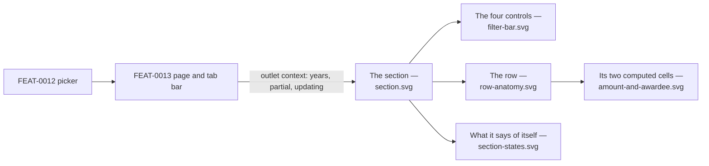

# Visual design — the licitacións section

Static visual mockups for [FEAT-0016](../README.md)'s UI: the **licitacións section** mounted in
[FEAT-0013](../../FEAT-0013-organo-contracts-page/README.md)'s outlet as this Órgano page's **second
family** — its year chooser, its two narrowings, its four orderings, the row and the two statements
the section makes about itself — using the project's Mantine stack
([ADR-0004](../../../architecture/0004-ui-stack-vite-mantine.md)) so implementation has a concrete,
faithful target.

These are **design artifacts, not code**: hand-authored SVG that mirrors the real Mantine `AppShell`,
`Card`, `Table`, `Select`, `Badge` and `Alert` components with the project theme. They are
impl-agnostic reference; the buildable UI is delivered by tasks 8 to 12.

The Órgano's name and the tab bar above the section are
[FEAT-0013](../../FEAT-0013-organo-contracts-page/design/README.md)'s and are drawn only as the frame
this section is mounted in; the picker in the navbar is
[FEAT-0012](../../FEAT-0012-organos-visible-set-and-browse/design/README.md)'s; the paging control is
[FEAT-0011](../../FEAT-0011-contratos-menores-browsing/design/README.md)'s, drawn here **unchanged**
because that is how it is used.

## Where this section departs from the contratos menores one

The two sections sit one tab apart, so a reader meets them in one session and every difference between
them has to be a decision rather than an accident. There are five, and each is forced by SPEC-0008
saying something SPEC-0005 does not.

| | Contratos menores | Licitacións | Why |
| --- | --- | --- | --- |
| Narrowings | year only | year **+ CPV + state** | R23. The source publishes a CPV for this family and none for the other |
| The amount | one column, one meaning | one column, **three bases** | R24 makes the figure an awarded sum *or* a base budget, never both |
| VAT label | on the **column header** | on the **budget only** | R7/#8 makes the *base budget* VAT-inclusive; nothing says an awarded sum is |
| Awardee | always exactly one, always named | **a count**, named only at one | R20, and a party R16 could not resolve is not counted at all |
| A missing value | impossible — the row is withheld | **routine** | R25 withholds only for an uninterpretable date, so a visible row may state no amount, no awardee and an unlabelled state |

The last one is the one to hold on to: **contratos menores has no absent-value rendering to design,
and this family needs one for four different cells.** A designer or task author carrying the first
section's habits across will draw placeholders where this family needs statements.

## Elements shown here that are deliberately not built, or that read a rule one way

The feature's requirements fix what a row **carries** and what the section **says**; several rendering
choices below are the mockups', and are recorded so nobody builds them believing a criterion demanded
them.

- **The ordering is one `Select` of four entries**, not sortable column headers — the same closure
  FEAT-0011 drew, for the same reason: R23 offers a closed set, and only two of the six columns could
  respond to a header affordance. Restated here rather than cross-referenced because a task author
  reading only this folder would otherwise have to guess.
- **The state badge is grey for every state, always.** The vocabulary is the source's own (R23) and
  gains members without a code change, so a colour map would have to invent a semantic for a state
  nobody has imported yet — and would be wrong the first time the source adds one. It is deliberately
  *not* the green/grey/red scale the administration area uses for health, because a licitación's state
  is a fact about a procedure, not a judgement about it.
- **A state with no label is drawn as `Estado 137`**, its code. The feature settles that such a state
  is *offered by its code* as a filter; that the **row** draws it the same way is this folder's
  choice, and the alternative — a blank cell — would read as a bug.
- **An `UNSTATED` amount keeps its caption and loses its figure.** The task forbids a zero and forbids
  an em dash standing in for a number; it does not say the cell is empty. `Sen importe publicado` is
  not a stand-in for a figure, it is the statement that there is none — and a wholly empty cell would
  leave a reader unable to tell "nothing published" from "the page failed to render it".
- **The partial marker is the amount's caption, not a badge.** It qualifies the figure — *this sum
  does not cover the whole procedure* — rather than classifying the row, and a badge would compete
  with the state badge two columns to its left for the same reading.
- **`3 adxudicatarios` is text, not a link.** R21's licitación page is the next feature's, so the
  crossing is named and unbuilt; a control that goes nowhere is worse than no control.
- **The masculine `Adxudicatario`** matches the shipped contratos menores column. Two adjacent tables
  using different words for the same column would be experienced as a defect rather than as a choice.
- **Date and amount formatting** (`12 mar 2025`, `1.284.500,00 €`) are presentation, not data. R33's
  *exactly as stored* governs the text the source publishes — the `obxecto`, the operador's name, the
  state's label — and a date and a decimal still have to be rendered in some locale.
- **The source identifier sits under the date**, dimmed and monospaced, on FEAT-0011's precedent: it
  is an identifier a reader copies rather than reads, and it is the tie-break that makes every
  ordering total.
- **The `FONTE` column is an icon-only link** and its accessible name **names the licitación it
  opens** — unlike FEAT-0011's static label, because SPEC-0008 #28 asks for a route "to the
  corresponding publication" and fifty identical link names identify nothing. A drawing cannot show
  it; the implementing task must not skip it.
- **A failed read is yellow**, on the rule the metrics panel already follows: the rows on screen are
  not wrong, they are *old*. Grey would read as inert and red as broken, and the section is neither.
- **The dashed indigo outline around the two *Histórico* entries in `filter-bar.svg` is an annotation,
  not a control state.** Nothing in the built menu outlines an option. It is drawn because that pair is
  the one thing on the sheet a reader's eye would otherwise slide past.

**What is deliberately absent, and must stay absent**: no free-text search over `obxecto`, no column
stating the awarding Órgano, no `expediente`, estimated value, procedure type or lote count, no hint
that anything was withheld, no per-row name for a party that did not resolve, and no empty state. The
first is SPEC-0008's recorded gap, the second is #28, the third is R21's page, the fourth follows from
R25, the fifth is #24, and the last is a consequence of presence being derived — see *How the design
meets the spec*.

## Screens

| File | Screen | Covers |
| --- | --- | --- |
| [`section.svg`](section.svg) | The section, in place | The second tab, the four controls, the six-column table and the reused paging control, inside FEAT-0013's page (SPEC-0008 #27, #28, #30, #32, #33, #34) |
| [`row-anatomy.svg`](row-anatomy.svg) | One row, annotated | Every value a row carries, why it is there, and what the row deliberately does not say (SPEC-0008 #10, #20, #24, #28, #29, #33, #35) |
| [`amount-and-awardee.svg`](amount-and-awardee.svg) | The two computed cells | The three amount bases and the partial marker; the four awardee cases including an unidentified consortium and an unresolved award (SPEC-0008 #8, #20, #24, #29, #35) |
| [`filter-bar.svg`](filter-bar.svg) | The four controls, open | Years that exist, CPV codes without descriptions, **two states sharing one label**, the four orderings, and what an over-narrowed selection looks like (SPEC-0008 #32, #33, #34) |
| [`section-states.svg`](section-states.svg) | What the section says about itself | *Partial*, *no longer updated*, both, neither, a page in flight and a failed read (SPEC-0008 #6 display half, #37) |



## Design language

The mockups reuse the `AppShell` chrome from `ui/src/app/layout/AppLayout.tsx` and the theme in
`ui/src/app/theme.ts`, and follow the tokens and status semantics stated in
[the `frontend-design` skill](../../../../.claude/skills/frontend-design/SKILL.md) and rendered by
[the administration-area mockups](../../../design/administration-area/README.md) — `indigo` primary,
`md` radius, `gray.0`/white surfaces, uppercase dimmed letter-spaced table headers on a `gray.0`
header row, `gray.1` hairlines between rows, Galician chrome throughout.

### What this feature adds

- **A four-control toolbar inside the card**: the year `Select`, the CPV `Select`, the state `Select`
  and the ordering `Select`, each under an uppercase dimmed label. The two filters are **clearable**
  and carry an `×` when they hold a value; the year has none, because it cannot be cleared.
- **A six-column table**: the date with its identifier stacked beneath, `obxecto` given the width to
  wrap, the state as a grey `Badge`, the awardee with its fiscal identifier beneath *or* a count, the
  amount right-aligned and bold **with its basis as a dimmed caption**, and the source link.
- **The amount cell is two lines, and the second line is load-bearing.** It is the only place the row
  says which of R24's figures it is showing, and it is the difference between a list a reader can add
  up wrongly and one they cannot.
- **The two state statements are Mantine `Alert`s** in the semantics this product already uses:
  *partial* is informational and takes `indigo` light; *no longer updated* is **inert and takes
  grey**, the same reading a disabled account gets. Neither is red.
- **The paging control is `shared/ui/Pagination`, drawn unchanged**, because it is used unchanged.
  Nothing in this folder proposes a variant of it.

## How the design meets the spec

- **One year, always (R22, #32)** — the chooser offers years the Órgano has visible licitacións in and
  nothing else: no *all years* entry and no *undated* entry, because neither exists in the domain. The
  gap between 2022 and 2019 in `filter-bar.svg` is drawn on purpose: years with no rows are simply not
  offered.
- **Two narrowings that can never be the reason a list is empty (R23, #33)** — each control offers
  only what the year's selection contains. `filter-bar.svg` also draws the residual honestly: with
  **both** chosen an empty list is reachable, so both controls stay populated and clearable, and the
  count reads a true zero rather than an error.
- **The state is filtered by code and read by label (#33)** — `filter-bar.svg` puts codes **101 and
  102, both labelled *Histórico***, in the same open menu with their codes visible, because this is
  the one defect in the section that a reader could never attribute: a label-keyed control merges two
  states the source distinguishes and looks correct doing it.
- **The amount states which figure it is (R24, #35)** — `amount-and-awardee.svg` draws all four
  renderings side by side with the rule that produces each. The client renders the basis it is given
  and computes nothing; that *which* basis a procedure gets is arithmetic proved against PostgreSQL,
  not something a mockup can settle.
- **VAT (R7, #8)** — the base budget is labelled VAT-inclusive **wherever it appears**. It is on the
  figure and not on the column header, because the header would claim the same of an awarded sum and
  nothing in the spec says that. The estimated value, which excludes VAT, never reaches a row.
- **The awardee, or how many (R20, #20, #24, #29)** — four cases, drawn: one named with its fiscal
  identifier, one named **without** one (an unidentified consortium is an awardee like any other), a
  count when there are several, and **zero** when the only award resolved to nobody. In no case does
  any cell render a published name the system could not resolve.
- **No row states the awarding Órgano (#28)** — every row of this list belongs to the Órgano already
  open, and the column is absent rather than empty.
- **Ordering and paging over the whole selection (#28, #30, #34)** — one control of four entries, the
  shared paging control, the record count from the envelope rather than from the rows in hand, and the
  two ends disabled rather than hidden. Touching any of the four controls returns to page 1; moving
  between pages changes nothing else.
- **The section states its own condition (#6 display half, #37)** — `section-states.svg` draws
  *partial* and *no longer updated* as two independent statements and shows them together, because an
  Órgano unmarked halfway through its initial import is both. It also draws the case where **neither**
  applies and the section says nothing at all: there is no "up to date" badge, because a section with
  nothing abnormal to report should not report.
- ❗ **The *partial* copy must not imply the newest year is present.** This family's initial walk is
  ordered by **identifier ascending**, so a partially imported Órgano's years fill in from the
  **oldest** end and it opens on the most recent year *it has so far* — which may be years behind the
  source. That is the **opposite** of contratos menores, and FEAT-0011's own mockup says so in the
  other direction. The copy in this folder is written for this family and must not be copied back.
- **There is no empty state, by construction** — the chooser offers only years that have visible
  licitacións, so no choice of *year alone* produces an empty list; and an Órgano with no visible
  licitación produces no summary, so no tab is drawn and this section never mounts.
- **Galician chrome (SPEC-0001 AC7)** — all copy in `ui/src/shared/lib/strings.ts`, this section's
  under its own namespace; the paging control's is already in a shared one and is not restated.

## Copy the screens introduce

The section's own namespace, `strings.licitacions`. The paging control's copy is **not** here — it is
the shared namespace FEAT-0011 established, and this section takes it unchanged.

| Key | Galician |
| --- | --- |
| `yearLabel` | Ano |
| `cpvLabel` / `cpvAll` | CPV / Todos os CPV |
| `stateLabel` / `stateAll` | Estado / Todos os estados |
| `sortLabel` | Ordenar por |
| `sort.dateDesc` | Data de publicación (máis recente primeiro) |
| `sort.dateAsc` | Data de publicación (máis antiga primeiro) |
| `sort.amountDesc` | Importe (maior primeiro) |
| `sort.amountAsc` | Importe (menor primeiro) |
| `columnDate` / `columnObxecto` / `columnState` | Data / Obxecto / Estado |
| `columnAwardee` / `columnAmount` / `columnSource` | Adxudicatario / Importe / Fonte |
| `amountAwarded` | Adxudicado |
| `amountAwardedPartial` | Adxudicado en parte |
| `amountBudget` | Orzamento base (IVE incl.) |
| `amountUnstated` | Sen importe publicado |
| `awardeeNone` | Sen adxudicatarios |
| `awardeeCount` | `{ singular: '{n} adxudicatario', plural: '{n} adxudicatarios' }` |
| `stateWithoutLabel` | Estado {code} *(a state the source published with no label)* |
| `sourceLinkLabel` | Ver a licitación {id} na fonte oficial *(the icon link's accessible name)* |
| `partialTitle` / `partialBody` | Importación en curso / Aínda se están a importar as licitacións deste órgano, así que o que ves aquí está incompleto e medra entre visitas. |
| `notUpdatedTitle` / `notUpdatedBody` | Este órgano xa non se actualiza / As licitacións xa importadas seguen aquí, pero non se engadirán novas. |
| `staleTitle` / `staleBody` | Non se puido actualizar a lista / Estás a ver a última páxina que se cargou ben. |
| `emptyNarrowing` | Ningunha licitación coincide |

`awardeeCount` travels as a singular/plural pair, the pattern `strings.ts` already uses for counted
nouns, so no call site can take one form and forget the other. `sourceLinkLabel` and
`stateWithoutLabel` take a parameter, which the shared `records` pair does not — the row's link and
its state cell both have to identify *which* row they belong to.

The tab label itself is **not** in this namespace: it is `organo.families.licitacions`, because the
tab bar belongs to FEAT-0013's page and reads its labels from the family registry.

## Regenerating previews

The SVGs are self-contained (no external assets) and open directly in a browser. To rasterise for
review:

```sh
inkscape design/section.svg --export-type=png --export-filename=section.png -w 1280
```
