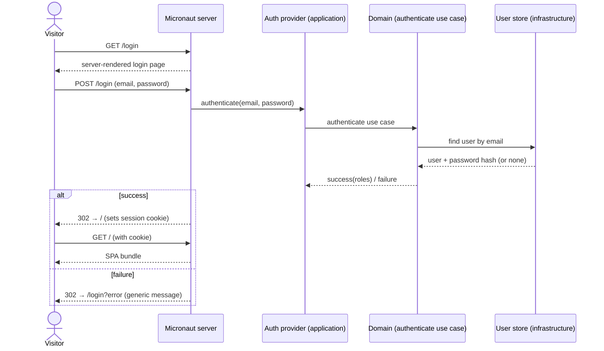
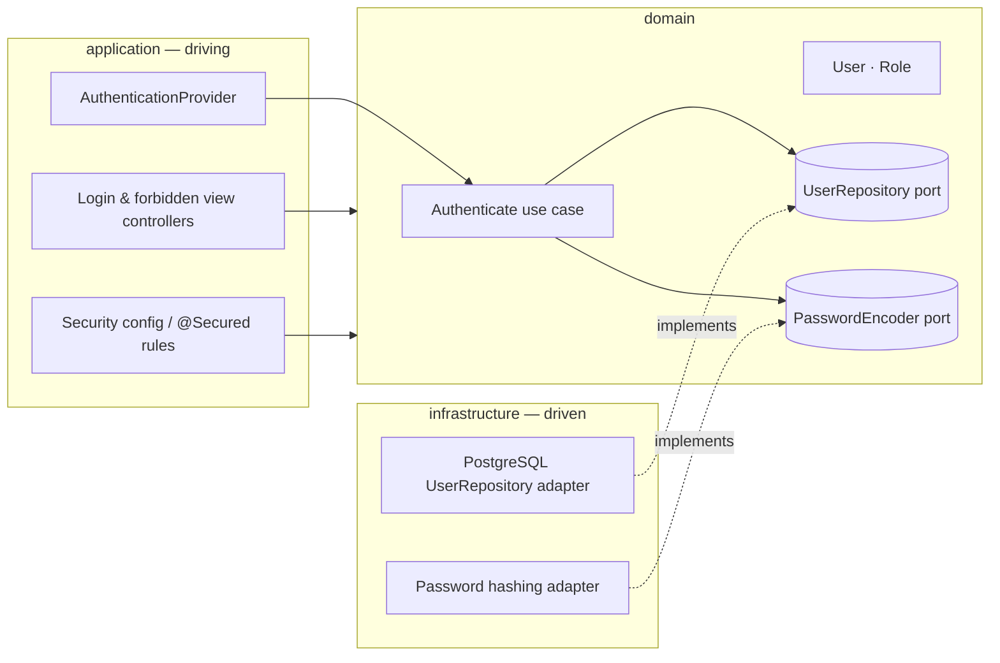

# FEAT-002 Login process

A buildable slice of [SPEC-001](../specs/SPEC-001-user-authentication.md): the
**login process** and the protection it puts around the rest of the system.

## Scope

In scope:

- A **server-rendered login page** with an email + password form, served by the
  backend outside the React Router SPA.
- Establishing an authenticated **session** on successful login and loading the
  SPA afterwards.
- **Redirecting** unauthenticated visitors and expired sessions to the login
  page, for both page navigations and API calls.
- Logout that ends the session.
- The `USER` / `ADMIN` role model, as far as it is needed to authenticate and to
  guard protected routes.

Out of scope (later features): the admin area itself, user management/onboarding
(creating users, password reset), and the data/analysis views. This feature only
establishes the gate in front of them.

## Governing decision

The mechanism below — **session-cookie authentication via Micronaut Security,
with a server-rendered login page separate from the SPA, and salted password
hashing** — is recorded in
[ADR-0004](../architecture/0004-session-based-authentication.md). The design here
applies that decision.

## Design

The backend is the single deployable unit and single origin (ADR-0003), so the
login pages, the SPA assets and the REST API are all served by the same
Micronaut server. Authentication is therefore handled once, at the server edge,
and protects every route uniformly. The design follows the hexagonal split of
ADR-0002.

### Login flow as static pages

- `GET /login` returns a **server-rendered static page** (a Micronaut View, not
  the SPA bundle). It is reachable anonymously.
- The form submits `email` + `password` to the framework login endpoint
  (`POST /login`), which is handled by Micronaut Security session authentication.
- On success the server creates a session, sets the session cookie, and
  redirects to the SPA entry point (`/`). The SPA loads only after a session
  exists.
- On failure the user is redirected back to the login page with a generic error
  (e.g. `/login?error`), which the page renders as a single message that does
  **not** say whether the email or the password was wrong (SPEC-001 criterion 3).



### Protecting routes and handling redirects

Routes are guarded with Micronaut Security's `@Secured` rules:

- SPA entry / data / analysis routes: `IS_AUTHENTICATED`.
- Admin-area routes: role `ADMIN`.
- `/login` and the login form endpoint: `IS_ANONYMOUS`.

Redirect behaviour differs by request type, and this distinction matters:

- **Page navigations** (an unauthenticated or expired-session visitor opening a
  protected URL) → **302 redirect to `/login`** (SPEC-001 criteria 1 and 7).
- **API / XHR calls** from an already-loaded SPA whose session has since expired
  → **401 Unauthorized**, not a redirect (a 302 to an HTML login page is useless
  to a fetch call). The SPA treats a 401 as "session gone" and navigates the
  browser to `/login`.

A `USER` who reaches an `ADMIN`-only route is **forbidden** (403 / a forbidden
page), distinct from being unauthenticated — they are logged in, just not
permitted (SPEC-001 criterion 5).

Indicative Micronaut configuration:

```yaml
micronaut:
  security:
    authentication: session
    redirect:
      login-success: /            # load the SPA
      login-failure: /login?error
      unauthorized:
        url: /login               # not logged in → login page
      forbidden:
        url: /forbidden           # logged in, wrong role
  session:
    http:
      cookie: true
```

### Hexagonal placement (ADR-0002)



- **domain** — `User` (identity, password hash, role), `Role` (`USER`, `ADMIN`),
  the `UserRepository` and `PasswordEncoder` ports, and the *authenticate* use
  case: look up the user by email, verify the password against the stored hash,
  return the user's role or a failure. No transport or persistence types.
- **application** — the Micronaut Security `AuthenticationProvider` that adapts an
  HTTP login request onto the domain use case; the controllers that render the
  static `login` / `forbidden` views; and the `@Secured` rules. Maps the domain
  `Role` to the framework role used by `@Secured`.
- **infrastructure** — the PostgreSQL `UserRepository` adapter and the password
  hashing adapter implementing the domain ports, plus Micronaut wiring.

### Credentials

- Stored passwords are **salted hashes** (SPEC-001 credential rules); the plain
  password is never stored, logged, or returned. Verification compares a hash,
  never the original.
- The authenticate use case returns only success-with-role or an indistinct
  failure — it never signals "no such email" vs "wrong password" separately, so
  the generic login error is enforced in the domain, not just the UI.

### Logout

`POST /logout` invalidates the session and redirects to `/login`. A subsequent
request to any protected route is then treated as unauthenticated (SPEC-001
criterion 7).

## Edge cases

- **Expired session mid-use**: handled by the navigation-vs-XHR split above — the
  SPA must act on a 401 by sending the user to `/login`.
- **CSRF**: the login form and logout are state-changing POSTs; CSRF protection
  for the form-login flow must be enabled (Micronaut Security supports it).
- **Already authenticated visitor opens `/login`**: send them to `/` rather than
  showing the form again.
- **Unknown vs wrong-password timing**: keep failure responses
  indistinguishable, including not short-circuiting the password check when the
  email is unknown, to avoid leaking which field was wrong.

## Acceptance mapping

Satisfies SPEC-001 acceptance criteria 1, 2, 3, 7, and 8 in full, and provides
the enforcement points for 4, 5, and 6 (the protected views/admin area that
exercise them arrive in later features).

## Work breakdown

Small, PR-sized changes — one issue ≈ one PR. Each references `FEAT-002` and the
governing ADRs. The created issues are listed under [GitHub issues](#github-issues).

1. Domain: `User`, `Role`, `UserRepository` + `PasswordEncoder` ports, and the
   authenticate use case (no infrastructure).
2. Infrastructure: PostgreSQL `UserRepository` adapter + schema, and the password
   hashing adapter.
3. Application: Micronaut Security session config, `AuthenticationProvider`, and
   `@Secured` rules across SPA / API / admin routes.
4. Application: server-rendered `login` and `forbidden` views + the login form;
   wire login-success to load the SPA.
5. Logout endpoint and the SPA's 401-handling redirect to `/login`.

## GitHub issues

PR-sized issues for this feature, grouped by the `FEAT-002` label. One issue ≈ one
PR; each maps to a work-breakdown item above.

| # | Issue | Breakdown |
| - | ----- | --------- |
| [#5](https://github.com/earelin/conxugal/issues/5) | Auth domain: User, Role and authenticate use case | 1 |
| [#6](https://github.com/earelin/conxugal/issues/6) | Auth infrastructure: PostgreSQL user store + password hashing adapters | 2 |
| [#7](https://github.com/earelin/conxugal/issues/7) | Security config: session auth, AuthenticationProvider and @Secured rules | 3 |
| [#8](https://github.com/earelin/conxugal/issues/8) | Server-rendered login + forbidden pages and login form | 4 |
| [#9](https://github.com/earelin/conxugal/issues/9) | Logout and SPA 401-handling redirect to login | 5 |
