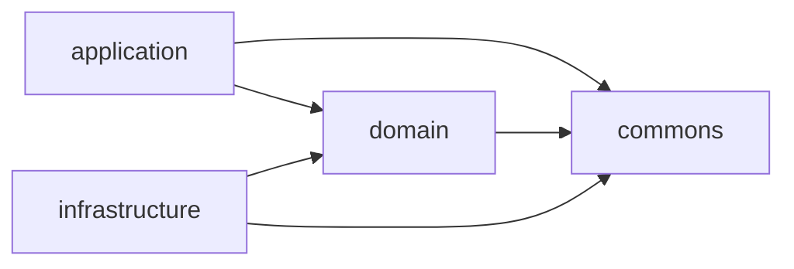

# CLAUDE.md

This file provides guidance to Claude Code (claude.ai/code) when working with code in this repository.

This is the `server/` module of conxugal — see the root `CLAUDE.md` for the repo-wide
spec-driven workflow (`SPEC → FEAT → TASK`). This module implements the backend
decided in `docs/architecture/0001-backend-stack.md` (Micronaut, Java 25, PostgreSQL,
REST) and `docs/architecture/0002-hexagonal-architecture.md` (the module split below).

## Commands

Run from `server/` (Gradle wrapper; Java 25 toolchain is pinned in the root
`build.gradle.kts` and auto-provisioned by Gradle if not installed):

- `./gradlew build` — compile, run all tests (`check`) and assemble all three modules
- `./gradlew test` — run all tests without assembling
- `./gradlew :application:test` — run tests in a single module (`:domain:test`,
  `:infrastructure:test` likewise)
- `./gradlew test --tests "<FullyQualifiedTestName>"` — run a single test class (works
  across all modules; scope to one with e.g. `:application:test --tests ...`)
- `./gradlew run` — run the application (`application` module; embedded Netty server on
  port 8080, see `application/src/main/resources/application.yml`)
- `./gradlew :infrastructure:integrationTest` — run `infrastructure`'s integration
  tests (adapters against a real PostgreSQL, started disposably via Testcontainers —
  needs a Docker daemon). Defined as a
  [JVM Test Suite](https://docs.gradle.org/current/userguide/jvm_test_suite_plugin.html)
  (`infrastructure/src/integrationTest`) that is deliberately **not** added to `check`,
  same as `application`'s and `acceptance` (see below).
- `./gradlew :application:integrationTest` — run `application`'s in-process Micronaut
  integration tests: full embedded-server HTTP round-trips (session auth, CSRF, idle
  timeout) against the real `@Controller`/security wiring rather than mocks. Also a
  JVM Test Suite (`application/src/integrationTest`), deliberately **not** added to
  `check` — unlike `infrastructure`'s, it needs no Docker daemon, just a JVM.
- `./gradlew :architecture:test` — run the ArchUnit rules that enforce the hexagonal
  dependency direction, `domain`'s transport/persistence-code purity, and the `/api/`
  URL prefix (see below). Static bytecode analysis only, no Docker/running instance
  needed, so it's part of `check`/`build` like `domain`'s and `infrastructure`'s tests.
- `./gradlew :domain:jacocoTestReport` / `:application:jacocoTestReport` /
  `:infrastructure:jacocoTestReport` — JaCoCo code coverage report for that module
  (`<module>/build/reports/jacoco/test/html/index.html`). For `application` and
  `infrastructure`, this runs **both** `test` and `integrationTest` and merges their
  coverage into one report; `domain` has no `integrationTest` suite, so it's unit-test
  coverage only. Not part of `check`/`build` — same opt-in treatment as
  `integrationTest` itself, so it doesn't force a Docker-dependent
  `infrastructure:integrationTest` run into the normal build.
- `./gradlew jacocoAggregatedReport` — combines coverage from `domain`, `application`
  and `infrastructure` (including their `integrationTest` suites where present) into
  one server-wide report (`build/reports/jacoco/jacocoAggregatedReport/html/index.html`).
- `./gradlew :domain:pitest` (likewise `:application:`, `:infrastructure:`, `:commons:`)
  — PIT mutation testing for that module (`<module>/build/reports/pitest/index.html`),
  wired via the shared `gal.conxugal.java-conventions` plugin so it's available
  everywhere, scoped to that module's own package and its unit `test` source set only
  (not `integrationTest`). Manually-invoked only — not part of `check`/`build`, same
  opt-in treatment as `integrationTest`/`jacocoTestReport`. `architecture`/`acceptance`
  also carry the task but have no `main` sources to mutate, so it's a no-op there.

## Fast feedback while iterating

`./gradlew build`/`test` never runs an `integrationTest` suite (each is deliberately
kept out of `check`, see above) — running only `test` after touching a controller or
an adapter gives a false green. Pick the narrowest command(s) that actually exercise
what changed:

| What changed | Run for feedback |
| --- | --- |
| `domain/src/main/java/**` (entities, ports, use cases) | `./gradlew :domain:test` |
| `infrastructure/src/main/java/**` — a class implementing a `domain` port (an adapter: repository, encoder, client, …) | `./gradlew :infrastructure:test :infrastructure:integrationTest` — the unit suite alone doesn't touch the real dependency the adapter drives |
| `infrastructure/src/main/resources/db/migration/**` (schema/migrations) | `./gradlew :infrastructure:integrationTest` |
| `application/src/main/java/**` (REST endpoints, security config, wiring) | `./gradlew :application:test :application:integrationTest` — the unit suite alone doesn't boot a real embedded server/security filter chain |
| `application/src/integrationTest/java/**` | `./gradlew :application:integrationTest` |
| `acceptance/src/test/java/**` | Needs a running instance first (see below); then `./gradlew acceptance` |
| Package layout or module dependencies anywhere under `domain`/`application`/`infrastructure` | `./gradlew :architecture:test` |
| Any `build.gradle.kts`, `gradle/libs.versions.toml`, or `settings.gradle.kts` | `./gradlew build` (full multi-module build) |
| Before committing, regardless of scope | `./gradlew build` (see below) |

## Migrations share one version sequence

Flyway is pointed at two locations — `db/migration`, which every environment runs, and
`db/migration-local`, which only `MICRONAUT_ENVIRONMENTS=local` adds (a developer's compose
stack and CI). They are **one numbered sequence with one history table**, so a version used
in either is used in both: `db/migration` skips `V4` because `migration-local` holds it. Take
the next free number across *both* folders when adding a versioned migration — reusing one
fails every local and CI boot with `Found more than one migration with version N`, and the
gap is easiest to miss from the shared set, whose own files simply step over it.

**Seed data belongs in a repeatable migration** (`R__…`), which takes no number and so cannot
collide. `db/migration-local/R__seed_test_catalogue.sql` is the model: a `${flyway:timestamp}`
placeholder on the first line rewrites its checksum on every run, which makes Flyway re-apply
it at every start, and every statement upserts rather than inserts. Fixtures the contract test
deletes or renames are therefore back in place next time the application comes up, without a
volume wipe.

## Before committing

Run `./gradlew build` from `server/` and fix any failures before committing changes
to this module. `build` never exercises either `integrationTest` suite (see above), so
also run `./gradlew :infrastructure:integrationTest` if the change touched an
`infrastructure` adapter, and `./gradlew :application:integrationTest` if it touched
`application`'s controllers, security config, or its `src/integrationTest`.

## Architecture

Four-module hexagonal (ports & adapters) Gradle build (ADR-0002, narrowed by ADR-0013),
wired only through `settings.gradle.kts` and Micronaut's DI container — there is no
other cross-module glue:

- **`domain`** — the core model, business rules, and the *ports* (interfaces) the
  other two modules implement/drive. Depends on nothing but `commons`. Free of
  transport and persistence concerns, though domain classes may still carry Micronaut
  DI annotations.
- **`application`** — the *driving side*: REST endpoints, schedulers, other triggers,
  and the use-case orchestration that coordinates `domain`. This is also the runnable
  Micronaut application (composition root: `Application.java`, `mainClass` in
  `application/build.gradle.kts`) and the single artifact that will serve the built UI
  (ADR-0003).
- **`infrastructure`** — the *driven side*: adapters implementing `domain` ports
  against external systems (PostgreSQL, scrapers/ingestors for
  contratosdegalicia.gal, exporters).
- **`commons`** (ADR-0013) — small, pure, framework-free utility code shared across
  the other modules (e.g. argument-validation helpers). No transport, persistence, DI
  or business-rule content. Depends on nothing.
- **`architecture`** — test-only module with no `main` sources; holds the ArchUnit
  rules (`./gradlew :architecture:test`) that enforce this section as executable
  checks rather than just prose: the dependency direction below, `domain`'s and
  `commons`' purity, and ADR-0006's `/api/` URL prefix. It's the one place allowed to
  see `domain`, `application`, `infrastructure` and `commons` on the same test
  classpath, which is what lets it check the cross-module rules Gradle's own project
  graph can't (e.g. "`application` must not depend on `infrastructure`").

**The dependency rule is load-bearing and intentional, not incidental:**
`application` depends on `domain` only — `runtimeOnly(project(":infrastructure"))` in
`application/build.gradle.kts` means infrastructure is assembled at *runtime only*, so
application code cannot compile against adapter types. `infrastructure` depends on
`domain` only and must never depend on `application`. The two outer modules meet
solely through domain ports and Micronaut's DI container at runtime — don't add a
compile-time edge between them. Domain types cross module boundaries directly; don't
add a DTO/mapping layer unless a concrete need arises (e.g. an external contract that
diverges from the domain shape). `commons` is the one dependency every module —
including `domain` — may take without breaking this rule; it must never depend back
on `domain`, `application` or `infrastructure`.

Dependency versions are centralized in `gradle/libs.versions.toml`; most
`io.micronaut*` and driver versions are left unversioned there because the Micronaut
platform BOM (`micronautVersion` in `gradle.properties`) resolves them at build time —
bump that one property rather than pinning individual library versions.

## The UI build is part of the server build

`./gradlew build`, `run` and `:application:dockerBuild` from `server/` all build the UI
first: `npmCi` → `npmBuild` → `copyUiDist` in `application/build.gradle.kts` run the
`ui/` module's own `npm ci` and `npm run build`, then copy `ui/dist` onto the runtime
classpath under `public/`, where `micronaut.router.static-resources` picks it up. **The
server build therefore needs Node**, not just a JVM — the version is pinned in
`ui/package.json`'s `volta.node`, which CI's `setup-node` reads — and a UI source change
reaches the next server build with no manual `npm run build`.

Two things here are load-bearing and easy to undo:

- **The dist is registered as a `resources` source dir**
  (`resources.srcDir(files(…).builtBy(copyUiDist))`), not as `output.dir`. `jar` reads
  the whole SourceSet output either way, so `output.dir` looks correct locally — but the
  Micronaut Gradle plugin's Docker `buildLayers` task reads only
  `output.resourcesDir`, and the SPA silently never reaches the image. Nothing in
  `build` catches it; `acceptance`'s `AuthenticatedSpaRoutingTest`, which CI runs
  against the built image, is what does.
- **Vite's `base` and the static-resource mapping must agree.** `ui/vite.config.ts` sets
  `base: '/'` to match `micronaut.router.static-resources.ui.mapping` (`/**`); serving
  the app under a sub-path means changing both. The only thing coupling them is
  `AuthenticatedSpaRoutingTest#root_serves_the_spa_shell_with_its_built_assets`, which
  fetches every `<script>`/`<link>` the rendered page actually references.

## HTTP routing conventions

The `application` module is the single origin for both the REST API and the built UI
(ADR-0003), so the two are split by URL prefix:

- **Every REST endpoint — current and future — is mounted under `/api/`** (e.g.
  `@Controller("/api/contracts")`), per
  `docs/architecture/0006-reserved-api-url-prefix.md`. An endpoint outside `/api/` is a
  defect; `./gradlew :architecture:test` enforces this for any `@Controller` that
  serves a non-HTML response (`ApiUrlPrefixArchTest`).
- **Everything else at `/`** is the UI: the built static assets
  (`micronaut.router.static-resources` in `application.yml`, fed by `ui/dist` via
  `copyUiDist` in `application/build.gradle.kts`) and the SPA history-fallback to
  `index.html` for unmatched non-`/api/` `GET` requests (`SpaHistoryFallback`, a global
  `@Error(status = NOT_FOUND)` handler). Fallback split for an unmatched request:
  - **`GET` for a client-side route** (outside `/api/`, not asset-shaped) → `index.html`
    (200) so React Router resolves it, including its own not-found page.
  - **`GET` for an asset that missed static-resource serving** — a path under `/assets/`
    or carrying a file extension → plain `404`, *not* the shell. Serving the shell here
    would mask a real miss (e.g. a stale hashed chunk after a redeploy) and hand the shell
    to anonymous callers of the public `/assets/` namespace.
  - **Under `/api/**`** → RFC 9457 `application/problem+json` `404`, matching the
    API-error shape `ServerErrorHandler` uses; never the shell.
  - **Any non-`GET`** → plain `404`.

## Authentication and authorization

Session-based per `docs/architecture/0005-session-based-authentication.md`, wired entirely
in `application.yml` (`micronaut.security`, `micronaut.session`) — read it for the cookie,
CSRF and redirect settings, whose trade-offs are commented there. `POST /login` and
`/logout` are Micronaut Security's own; only `GET /login` and `GET /forbidden` are ours
(`http/auth/`), and `GET /login` sends an already-authenticated visitor to `/`. Idle window
is **30 minutes**; sessions are in-memory, so a second replica needs a shared store first.
`application/src/integrationTest/.../http/auth/` pins all of it.

Four things here are easy to break by accident:

- **Failure is indistinct across three branches.** An unknown email still pays for a
  password comparison (`PasswordEncoder.matchAgainstDummyHash`), and a disabled account is
  rejected *after* its password check. Moving the `enabled` check earlier in
  `domain/auth/Authenticate` looks like a harmless reorder and breaks the rule.
- **Authorization is declared twice** — the `intercept-url-map` and a `@Secured` on almost
  every controller — and **nothing enforces that they agree**. A new controller needs the
  annotation even when the URL map appears to cover it.
- **Rejection is content-negotiated, not custom**: a browser navigation gets `303` to
  `/login`, an XHR gets `401`. There is no `RejectionHandler` here and writing one would
  silently change both halves (`AcceptHeaderRejectionTest`).
- **The last-login stamp is best-effort** — if the write fails the login still succeeds.

An account's whole lifecycle is create → enable/disable, and **nothing else**. An
administrator creates one through `POST /api/admin/users`; the server mints the initial
password and returns it in that one response. There is no reset, no change-password and no
delete anywhere — `UserRepository` exposes no password write after `create`, and SPEC-0003 R11
forbids removal. Since `users.email` is `UNIQUE`, **an initial password lost before it reaches
its user strands that address permanently**: the account cannot be recreated under the same
email, cannot be deleted, and cannot be given a new password through any endpoint. Restoring
access today means an operator `UPDATE`ing `password_hash` by hand. Treat that as the cost of
adding any other write-once credential, and disabling the last enabled `ADMIN` is refused
(`SetUserEnabled`) so the area itself can never become unreachable the same way.

**A role is fixed at creation, and `SetUserEnabled` is built on that.** Its guard takes a
`FOR UPDATE` lock over the enabled-admin set only when the target is a *currently-enabled*
admin, which is sound precisely because no other case can newly become the guarded one
mid-transaction. Nothing enforces the invariant — there is no constraint, no test and no
endpoint that writes `role` after `create`. Adding role editing (still unbuilt, along with
email editing, self-registration and audit logging of admin actions) therefore breaks that
guard silently: it would have to lock unconditionally, or lock the row it is about to
promote. Read `SetUserEnabled`'s Javadoc before touching either.

The three views in `resources/views/` (login, forbidden, server error) render outside the
SPA so a denial or a crash never depends on the React bundle; the bundle itself is served
only once a session exists. Their styling hand-copies the Mantine palette from
`ui/src/app/theme.ts` and drifts silently — see the `frontend-design` skill before
changing either.

<!-- distilled-from: FEAT-0002 @ 6d8a9f4 -->
<!-- distilled-from: FEAT-0003 @ 73cf32f -->
<!-- distilled-from: FEAT-0004 @ 7402d8a -->
