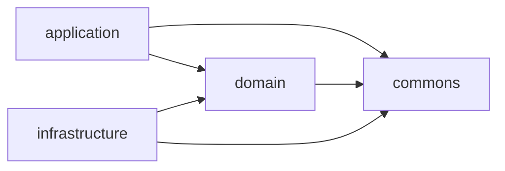

# CLAUDE.md

This file provides guidance to Claude Code (claude.ai/code) when working with code in this repository.

This is the `server/` module of conxugal — see the root `CLAUDE.md` for the repo-wide
spec-driven workflow (`SPEC → FEAT → TASK`). This module implements the backend
decided in `docs/architecture/0001-backend-stack.md` (Micronaut, Java 25, PostgreSQL,
REST) and `docs/architecture/0002-hexagonal-architecture.md` (the module split below).

## Commands

Run from `server/` (Gradle wrapper; Java 25 toolchain is pinned in the root
`build.gradle.kts` and auto-provisioned by Gradle if not installed):

- `./gradlew build` — compile, run all tests (`check`) and assemble all three modules
- `./gradlew test` — run all tests without assembling
- `./gradlew :application:test` — run tests in a single module (`:domain:test`,
  `:infrastructure:test` likewise)
- `./gradlew test --tests "<FullyQualifiedTestName>"` — run a single test class (works
  across all modules; scope to one with e.g. `:application:test --tests ...`)
- `./gradlew run` — run the application (`application` module; embedded Netty server on
  port 8080, see `application/src/main/resources/application.yml`)
- `./gradlew :infrastructure:integrationTest` — run `infrastructure`'s integration
  tests (adapters against a real PostgreSQL, started disposably via Testcontainers —
  needs a Docker daemon). Defined as a
  [JVM Test Suite](https://docs.gradle.org/current/userguide/jvm_test_suite_plugin.html)
  (`infrastructure/src/integrationTest`) that is deliberately **not** added to `check`,
  same as `application`'s and `acceptance` (see below).
- `./gradlew :application:integrationTest` — run `application`'s in-process Micronaut
  integration tests: full embedded-server HTTP round-trips (session auth, CSRF, idle
  timeout) against the real `@Controller`/security wiring rather than mocks. Also a
  JVM Test Suite (`application/src/integrationTest`), deliberately **not** added to
  `check` — unlike `infrastructure`'s, it needs no Docker daemon, just a JVM.
- `./gradlew :architecture:test` — run the ArchUnit rules that enforce the hexagonal
  dependency direction, `domain`'s transport/persistence-code purity, and the `/api/`
  URL prefix (see below). Static bytecode analysis only, no Docker/running instance
  needed, so it's part of `check`/`build` like `domain`'s and `infrastructure`'s tests.
- `./gradlew :domain:jacocoTestReport` / `:application:jacocoTestReport` /
  `:infrastructure:jacocoTestReport` — JaCoCo code coverage report for that module
  (`<module>/build/reports/jacoco/test/html/index.html`). For `application` and
  `infrastructure`, this runs **both** `test` and `integrationTest` and merges their
  coverage into one report; `domain` has no `integrationTest` suite, so it's unit-test
  coverage only. Not part of `check`/`build` — same opt-in treatment as
  `integrationTest` itself, so it doesn't force a Docker-dependent
  `infrastructure:integrationTest` run into the normal build.
- `./gradlew jacocoAggregatedReport` — combines coverage from `domain`, `application`
  and `infrastructure` (including their `integrationTest` suites where present) into
  one server-wide report (`build/reports/jacoco/jacocoAggregatedReport/html/index.html`).
- `./gradlew :domain:pitest` (likewise `:application:`, `:infrastructure:`, `:commons:`)
  — PIT mutation testing for that module (`<module>/build/reports/pitest/index.html`),
  wired via the shared `gal.conxugal.java-conventions` plugin so it's available
  everywhere, scoped to that module's own package and its unit `test` source set only
  (not `integrationTest`). Manually-invoked only — not part of `check`/`build`, same
  opt-in treatment as `integrationTest`/`jacocoTestReport`. `architecture`/`acceptance`
  also carry the task but have no `main` sources to mutate, so it's a no-op there.

## Fast feedback while iterating

`./gradlew build`/`test` never runs an `integrationTest` suite (each is deliberately
kept out of `check`, see above) — running only `test` after touching a controller or
an adapter gives a false green. Pick the narrowest command(s) that actually exercise
what changed:

| What changed | Run for feedback |
| --- | --- |
| `domain/src/main/java/**` (entities, ports, use cases) | `./gradlew :domain:test` |
| `infrastructure/src/main/java/**` — a class implementing a `domain` port (an adapter: repository, encoder, client, …) | `./gradlew :infrastructure:test :infrastructure:integrationTest` — the unit suite alone doesn't touch the real dependency the adapter drives |
| `infrastructure/src/main/resources/db/migration/**` (schema/migrations) | `./gradlew :infrastructure:integrationTest` |
| `application/src/main/java/**` (REST endpoints, security config, wiring) | `./gradlew :application:test :application:integrationTest` — the unit suite alone doesn't boot a real embedded server/security filter chain |
| `application/src/integrationTest/java/**` | `./gradlew :application:integrationTest` |
| `acceptance/src/test/java/**` | Needs a running instance first (see below); then `./gradlew acceptance` |
| Package layout or module dependencies anywhere under `domain`/`application`/`infrastructure` | `./gradlew :architecture:test` |
| Any `build.gradle.kts`, `gradle/libs.versions.toml`, or `settings.gradle.kts` | `./gradlew build` (full multi-module build) |
| Before committing, regardless of scope | `./gradlew build` (see below) |

## Migrations share one version sequence

Flyway is pointed at two locations — `db/migration`, which every environment runs, and
`db/migration-local`, which only `MICRONAUT_ENVIRONMENTS=local` adds (a developer's compose
stack and CI). They are **one numbered sequence with one history table**, so a version used
in either is used in both: `db/migration` skips `V4` because `migration-local` holds it. Take
the next free number across *both* folders when adding a versioned migration — reusing one
fails every local and CI boot with `Found more than one migration with version N`, and the
gap is easiest to miss from the shared set, whose own files simply step over it.

**Seed data belongs in a repeatable migration** (`R__…`), which takes no number and so cannot
collide. `db/migration-local/R__seed_test_catalogue.sql` is the model: a `${flyway:timestamp}`
placeholder on the first line rewrites its checksum on every run, which makes Flyway re-apply
it at every start, and every statement upserts rather than inserts. Fixtures the contract test
deletes or renames are therefore back in place next time the application comes up, without a
volume wipe.

## Before committing

Run `./gradlew build` from `server/` and fix any failures before committing changes
to this module. `build` never exercises either `integrationTest` suite (see above), so
also run `./gradlew :infrastructure:integrationTest` if the change touched an
`infrastructure` adapter, and `./gradlew :application:integrationTest` if it touched
`application`'s controllers, security config, or its `src/integrationTest`.

## Architecture

Four-module hexagonal (ports & adapters) Gradle build (ADR-0002, narrowed by ADR-0013),
wired only through `settings.gradle.kts` and Micronaut's DI container — there is no
other cross-module glue:

- **`domain`** — the core model, business rules, and the *ports* (interfaces) the
  other two modules implement/drive. Depends on nothing but `commons`. Free of
  transport and persistence concerns, though domain classes may still carry Micronaut
  DI annotations.
- **`application`** — the *driving side*: REST endpoints, schedulers, other triggers,
  and the use-case orchestration that coordinates `domain`. This is also the runnable
  Micronaut application (composition root: `Application.java`, `mainClass` in
  `application/build.gradle.kts`) and the single artifact that will serve the built UI
  (ADR-0003).
- **`infrastructure`** — the *driven side*: adapters implementing `domain` ports
  against external systems (PostgreSQL, scrapers/ingestors for
  contratosdegalicia.gal, exporters).
- **`commons`** (ADR-0013) — small, pure, framework-free utility code shared across
  the other modules (e.g. argument-validation helpers). No transport, persistence, DI
  or business-rule content. Depends on nothing.
- **`architecture`** — test-only module with no `main` sources; holds the ArchUnit
  rules (`./gradlew :architecture:test`) that enforce this section as executable
  checks rather than just prose: the dependency direction below, `domain`'s and
  `commons`' purity, and ADR-0006's `/api/` URL prefix. It's the one place allowed to
  see `domain`, `application`, `infrastructure` and `commons` on the same test
  classpath, which is what lets it check the cross-module rules Gradle's own project
  graph can't (e.g. "`application` must not depend on `infrastructure`").

**The dependency rule is load-bearing and intentional, not incidental:**
`application` depends on `domain` only — `runtimeOnly(project(":infrastructure"))` in
`application/build.gradle.kts` means infrastructure is assembled at *runtime only*, so
application code cannot compile against adapter types. `infrastructure` depends on
`domain` only and must never depend on `application`. The two outer modules meet
solely through domain ports and Micronaut's DI container at runtime — don't add a
compile-time edge between them. Domain types cross module boundaries directly; don't
add a DTO/mapping layer unless a concrete need arises (e.g. an external contract that
diverges from the domain shape). `commons` is the one dependency every module —
including `domain` — may take without breaking this rule; it must never depend back
on `domain`, `application` or `infrastructure`.

Dependency versions are centralized in `gradle/libs.versions.toml`; most
`io.micronaut*` and driver versions are left unversioned there because the Micronaut
platform BOM (`micronautVersion` in `gradle.properties`) resolves them at build time —
bump that one property rather than pinning individual library versions.

## HTTP routing conventions

The `application` module is the single origin for both the REST API and the built UI
(ADR-0003), so the two are split by URL prefix:

- **Every REST endpoint — current and future — is mounted under `/api/`** (e.g.
  `@Controller("/api/contracts")`), per
  `docs/architecture/0006-reserved-api-url-prefix.md`. An endpoint outside `/api/` is a
  defect; `./gradlew :architecture:test` enforces this for any `@Controller` that
  serves a non-HTML response (`ApiUrlPrefixArchTest`).
- **Everything else at `/`** is the UI: the built static assets
  (`micronaut.router.static-resources` in `application.yml`, fed by `ui/dist` via
  `copyUiDist` in `application/build.gradle.kts`) and the SPA history-fallback to
  `index.html` for unmatched non-`/api/` `GET` requests (`SpaHistoryFallback`, a global
  `@Error(status = NOT_FOUND)` handler). Fallback split for an unmatched request:
  - **`GET` for a client-side route** (outside `/api/`, not asset-shaped) → `index.html`
    (200) so React Router resolves it, including its own not-found page.
  - **`GET` for an asset that missed static-resource serving** — a path under `/assets/`
    or carrying a file extension → plain `404`, *not* the shell. Serving the shell here
    would mask a real miss (e.g. a stale hashed chunk after a redeploy) and hand the shell
    to anonymous callers of the public `/assets/` namespace.
  - **Under `/api/**`** → RFC 9457 `application/problem+json` `404`, matching the
    API-error shape `ServerErrorHandler` uses; never the shell.
  - **Any non-`GET`** → plain `404`.

## Authentication and authorization

Session-based, per `docs/architecture/0005-session-based-authentication.md`: a login
establishes server-held session state identified by a `SESSION` cookie, and logout
invalidates it. `POST /login` and `/logout` are Micronaut Security's own endpoints,
configured and not written here; only `GET /login` and `GET /forbidden` are hand-written
(`http/auth/LoginController`, `ForbiddenController`). `GET /login` **redirects an
already-authenticated visitor to `/`** rather than showing the form again. Everything else
below is wired in `application/src/main/resources/application.yml` under
`micronaut.security` and `micronaut.session`, and pinned by
`application/src/integrationTest`.

- **Idle window: 30 minutes** (`micronaut.session.max-inactive-interval: 30m`) — the
  concrete value SPEC-0002 R10 leaves to the implementation. `IdleSessionTimeoutTest`
  pins the behaviour by overriding the property to `1s`, so the guarantee is tested
  without waiting out the real window; the window itself is only ever the config value.
- **Session store is in-memory.** Nothing shares it between instances, so more than one
  replica needs a shared store first — the horizontal-scaling caveat ADR-0005 records.
- **Rejection is content-negotiated, not custom.** `micronaut.security.redirect.enabled`
  plus Micronaut's stock rejection handler answer a browser navigation (`Accept:
  text/html`) with a `303` to `/login`, and anything else — an XHR asking for JSON — with
  a bare `401`. There is no `RejectionHandler` implementation in this codebase, and
  writing one would silently change both halves; `AcceptHeaderRejectionTest` holds them
  together. The same split is why `acceptance`'s anonymous client deliberately sends
  `Accept: application/json`.
- **Authorization is declared twice.** The `intercept-url-map` in `application.yml`
  (`/api/admin/**` → `ADMIN`, `/api/**` and `/**` → authenticated, and exactly three
  anonymous patterns — `/login`, `/health` and `/assets/static-pages/**`, the last being
  what lets the server-rendered pages below load their stylesheet before a session
  exists) and a `@Secured` annotation on almost every controller. Both
  must agree and **nothing enforces that they do** — `:architecture:test` checks module
  boundaries and the `/api/` prefix, not security coverage. A new controller needs the
  annotation even when the URL map appears to cover it.
- **The session cookie is `SameSite=Lax` and not Base64-encoded**, both stated rather than
  defaulted; the comments in `application.yml` explain what each closes. CSRF covers the
  server-rendered form flow only and is withdrawn from `/api/**` — same file, same
  reasoning.

### The authenticate contract

`domain/auth/Authenticate` is the whole rule; `UserAuthenticationProvider` only adapts it
to Micronaut Security, mapping every rejection to one `CREDENTIALS_DO_NOT_MATCH`.

- **Failure is indistinct across three branches, not two.** An unknown email still pays for
  a password comparison (`PasswordEncoder.matchAgainstDummyHash`), and a **disabled account
  is rejected only after its password has been checked** — so unknown-vs-wrong-vs-disabled
  is separable neither by message nor by timing. Moving the `enabled` check earlier would
  look like a harmless reorder and would break the rule.
- **The last-login stamp is best-effort.** A successful authentication writes
  `lastLoginAt` through the repository port, but the write is wrapped: if it fails, the
  login still succeeds and returns the user unstamped. A failed authentication writes
  nothing, on any branch.
- The instant comes from the `domain/time/Clock` port, so the stamping is unit-testable
  against a fixed clock.

### Server-rendered pages

Three Thymeleaf views in `application/src/main/resources/views/` render outside the SPA, so
a login, a denial or a crash never depends on the React bundle booting: `login.html`
(the form, and the single generic failure message), `forbidden.html`, and
`server-error.html`. The SPA bundle is served only once a session exists — `/**` requires
authentication — which is what makes `SpaHistoryFallback` safe to hand `index.html` to any
unmatched non-asset `GET`.

The latter two are separate files sharing a `status-card` markup and class vocabulary, not
a Thymeleaf fragment, so a new error page is a copy change rather than a new layout. **No
`404` renders them**: an unmatched `/api/**` path answers `application/problem+json`
(`SpaHistoryFallback`) and anything else answers a bare `404`. Galician copy lives in the
templates themselves.

Their styling is `application/src/main/resources/static-pages/static-pages.css`, which
**hand-copies** the Mantine palette out of `ui/src/app/theme.ts` as CSS custom properties —
the two modules cannot share a build, so nothing keeps them in sync. Change the theme and
change this file too. For the same reason `views/fragments/brand.html` inlines the logo's
SVG paths instead of referencing `/logo.svg`, which is the rule everywhere in `ui/`: these
templates cannot reach `ui/public/`.

`CsrfProtectedPage` renders the first two and attaches the CSRF cookie, **reusing a
still-valid token** rather than minting one per render: a fresh token on every render
breaks double-submit when the browser is redirected to `/login` and then loads it.
`server-error.html` is rendered directly by `http/error/ServerErrorHandler` and carries no
CSRF cookie.

<!-- distilled-from: FEAT-0002 @ 6d8a9f4 -->
