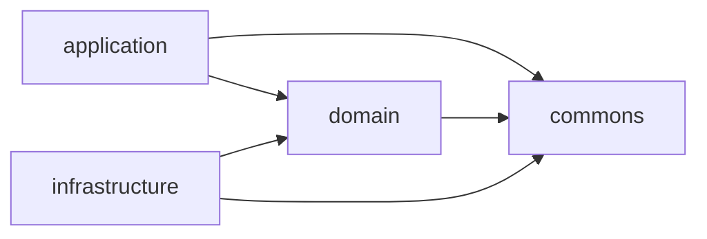

# CLAUDE.md

This file provides guidance to Claude Code (claude.ai/code) when working with code in this repository.

This is the `server/` module of conxugal — see the root `CLAUDE.md` for the repo-wide
spec-driven workflow (`SPEC → FEAT → TASK`). This module implements the backend
decided in `docs/architecture/0001-backend-stack.md` (Micronaut, Java 25, PostgreSQL,
REST) and `docs/architecture/0002-hexagonal-architecture.md` (the module split below).

## Code style

Java code follows [Google Java Format](https://google.github.io/styleguide/javaguide.html):
2-space indentation, 100-column line length, no wildcard imports, K&R brace style
(same-line `{`, `case`/`default` bodies on a new line). This is enforced by
Checkstyle — `config/checkstyle/checkstyle.xml` is Google's `google_checks.xml` — but
no formatter is wired into the build, so checkstyle only lints, it doesn't reformat.
Write new code matching the style directly; run `checkstyleMain`/`checkstyleTest`
(part of `./gradlew build`) to verify.

Long fluent call chains — notably REST-assured's `given()/when()/then()` in
`application/src/integrationTest` — are formatted as a staircase: each stage keyword
sits at the base indent, calls chained onto that stage indent one level (4 spaces)
deeper, and the next stage keyword steps back out to the base indent:

```java
given(spec)
    .header(HttpHeaders.COOKIE, sessionCookie)
    .body("{}")
.when()
    .post("/logout");
```

## Commands

Run from `server/` (Gradle wrapper; Java 25 toolchain is pinned in the root
`build.gradle.kts` and auto-provisioned by Gradle if not installed):

- `./gradlew build` — compile, run all tests (`check`) and assemble all three modules
- `./gradlew test` — run all tests without assembling
- `./gradlew :application:test` — run tests in a single module (`:domain:test`,
  `:infrastructure:test` likewise)
- `./gradlew test --tests "<FullyQualifiedTestName>"` — run a single test class (works
  across all modules; scope to one with e.g. `:application:test --tests ...`)
- `./gradlew run` — run the application (`application` module; embedded Netty server on
  port 8080, see `application/src/main/resources/application.yml`)
- `./gradlew :infrastructure:integrationTest` — run `infrastructure`'s integration
  tests (adapters against a real PostgreSQL, started disposably via Testcontainers —
  needs a Docker daemon). Defined as a
  [JVM Test Suite](https://docs.gradle.org/current/userguide/jvm_test_suite_plugin.html)
  (`infrastructure/src/integrationTest`) that is deliberately **not** added to `check`,
  same as `application`'s and `acceptance` (see below).
- `./gradlew :application:integrationTest` — run `application`'s in-process Micronaut
  integration tests: full embedded-server HTTP round-trips (session auth, CSRF, idle
  timeout) against the real `@Controller`/security wiring rather than mocks. Also a
  JVM Test Suite (`application/src/integrationTest`), deliberately **not** added to
  `check` — unlike `infrastructure`'s, it needs no Docker daemon, just a JVM.
- `./gradlew :architecture:test` — run the ArchUnit rules that enforce the hexagonal
  dependency direction, `domain`'s transport/persistence-code purity, and the `/api/`
  URL prefix (see below). Static bytecode analysis only, no Docker/running instance
  needed, so it's part of `check`/`build` like `domain`'s and `infrastructure`'s tests.
- `./gradlew :domain:jacocoTestReport` / `:application:jacocoTestReport` /
  `:infrastructure:jacocoTestReport` — JaCoCo code coverage report for that module
  (`<module>/build/reports/jacoco/test/html/index.html`). For `application` and
  `infrastructure`, this runs **both** `test` and `integrationTest` and merges their
  coverage into one report; `domain` has no `integrationTest` suite, so it's unit-test
  coverage only. Not part of `check`/`build` — same opt-in treatment as
  `integrationTest` itself, so it doesn't force a Docker-dependent
  `infrastructure:integrationTest` run into the normal build.
- `./gradlew jacocoAggregatedReport` — combines coverage from `domain`, `application`
  and `infrastructure` (including their `integrationTest` suites where present) into
  one server-wide report (`build/reports/jacoco/jacocoAggregatedReport/html/index.html`).

## Fast feedback while iterating

`./gradlew build`/`test` never runs an `integrationTest` suite (each is deliberately
kept out of `check`, see above) — running only `test` after touching a controller or
an adapter gives a false green. Pick the narrowest command(s) that actually exercise
what changed:

| What changed | Run for feedback |
| --- | --- |
| `domain/src/main/java/**` (entities, ports, use cases) | `./gradlew :domain:test` |
| `infrastructure/src/main/java/**` — a class implementing a `domain` port (an adapter: repository, encoder, client, …) | `./gradlew :infrastructure:test :infrastructure:integrationTest` — the unit suite alone doesn't touch the real dependency the adapter drives |
| `infrastructure/src/main/resources/db/migration/**` (schema/migrations) | `./gradlew :infrastructure:integrationTest` |
| `application/src/main/java/**` (REST endpoints, security config, wiring) | `./gradlew :application:test :application:integrationTest` — the unit suite alone doesn't boot a real embedded server/security filter chain |
| `application/src/integrationTest/java/**` | `./gradlew :application:integrationTest` |
| `acceptance/src/test/java/**` | Needs a running instance first (see below); then `./gradlew acceptance` |
| Package layout or module dependencies anywhere under `domain`/`application`/`infrastructure` | `./gradlew :architecture:test` |
| Any `build.gradle.kts`, `gradle/libs.versions.toml`, or `settings.gradle.kts` | `./gradlew build` (full multi-module build) |
| Before committing, regardless of scope | `./gradlew build` (see below) |

## Writing and editing tests

When creating or editing a test in this module, invoke the matching skill from the
`backend` plugin first and follow it — do not hand-write these tests from scratch. Each
skill owns the tooling, structure, and conventions for its test kind:

| Test kind | Where it lives | Skill (`backend` plugin) |
| --- | --- | --- |
| Unit — a class's logic in isolation (no context, DB, or network) | `<module>/src/test/java/**` | `/java-unit-test` |
| Integration — crosses a process boundary (repository/DAO, controller over HTTP, client, Testcontainers-backed dependency) | `application`/`infrastructure` `src/integrationTest/java/**` | `/java-integration-test` |
| Acceptance — black-box scenario against a running instance | `acceptance/src/test/java/**` | `/java-acceptance-test` |

## Before committing

Run `./gradlew build` from `server/` and fix any failures before committing changes
to this module. `build` never exercises either `integrationTest` suite (see above), so
also run `./gradlew :infrastructure:integrationTest` if the change touched an
`infrastructure` adapter, and `./gradlew :application:integrationTest` if it touched
`application`'s controllers, security config, or its `src/integrationTest`.

## Architecture

Four-module hexagonal (ports & adapters) Gradle build (ADR-0002, narrowed by ADR-0013),
wired only through `settings.gradle.kts` and Micronaut's DI container — there is no
other cross-module glue:



- **`domain`** — the core model, business rules, and the *ports* (interfaces) the
  other two modules implement/drive. Depends on nothing but `commons`. Free of
  transport and persistence concerns, though domain classes may still carry Micronaut
  DI annotations.
- **`application`** — the *driving side*: REST endpoints, schedulers, other triggers,
  and the use-case orchestration that coordinates `domain`. This is also the runnable
  Micronaut application (composition root: `Application.java`, `mainClass` in
  `application/build.gradle.kts`) and the single artifact that will serve the built UI
  (ADR-0003).
- **`infrastructure`** — the *driven side*: adapters implementing `domain` ports
  against external systems (PostgreSQL, scrapers/ingestors for
  contratosdegalicia.gal, exporters).
- **`commons`** (ADR-0013) — small, pure, framework-free utility code shared across
  the other modules (e.g. argument-validation helpers). No transport, persistence, DI
  or business-rule content. Depends on nothing.
- **`architecture`** — test-only module with no `main` sources; holds the ArchUnit
  rules (`./gradlew :architecture:test`) that enforce this section as executable
  checks rather than just prose: the dependency direction below, `domain`'s and
  `commons`' purity, and ADR-0006's `/api/` URL prefix. It's the one place allowed to
  see `domain`, `application`, `infrastructure` and `commons` on the same test
  classpath, which is what lets it check the cross-module rules Gradle's own project
  graph can't (e.g. "`application` must not depend on `infrastructure`").

**The dependency rule is load-bearing and intentional, not incidental:**
`application` depends on `domain` only — `runtimeOnly(project(":infrastructure"))` in
`application/build.gradle.kts` means infrastructure is assembled at *runtime only*, so
application code cannot compile against adapter types. `infrastructure` depends on
`domain` only and must never depend on `application`. The two outer modules meet
solely through domain ports and Micronaut's DI container at runtime — don't add a
compile-time edge between them. Domain types cross module boundaries directly; don't
add a DTO/mapping layer unless a concrete need arises (e.g. an external contract that
diverges from the domain shape). `commons` is the one dependency every module —
including `domain` — may take without breaking this rule; it must never depend back
on `domain`, `application` or `infrastructure`.

Dependency versions are centralized in `gradle/libs.versions.toml`; most
`io.micronaut*` and driver versions are left unversioned there because the Micronaut
platform BOM (`micronautVersion` in `gradle.properties`) resolves them at build time —
bump that one property rather than pinning individual library versions.

## HTTP routing conventions

The `application` module is the single origin for both the REST API and the built UI
(ADR-0003), so the two are split by URL prefix:

- **Every REST endpoint — current and future — is mounted under `/api/`** (e.g.
  `@Controller("/api/contracts")`), per
  `docs/architecture/0006-reserved-api-url-prefix.md`. An endpoint outside `/api/` is a
  defect; `./gradlew :architecture:test` enforces this for any `@Controller` that
  serves a non-HTML response (`ApiUrlPrefixArchTest`).
- **Everything else at `/`** is the UI: the built static assets
  (`micronaut.router.static-resources` in `application.yml`, fed by `ui/dist` via
  `copyUiDist` in `application/build.gradle.kts`) and the SPA history-fallback to
  `index.html` for unmatched non-`/api/` `GET` requests (`SpaHistoryFallback`, a global
  `@Error(status = NOT_FOUND)` handler). Fallback split for an unmatched request:
  - **`GET` for a client-side route** (outside `/api/`, not asset-shaped) → `index.html`
    (200) so React Router resolves it, including its own not-found page.
  - **`GET` for an asset that missed static-resource serving** — a path under `/assets/`
    or carrying a file extension → plain `404`, *not* the shell. Serving the shell here
    would mask a real miss (e.g. a stale hashed chunk after a redeploy) and hand the shell
    to anonymous callers of the public `/assets/` namespace.
  - **Under `/api/**`** → RFC 9457 `application/problem+json` `404`, matching the
    API-error shape `ServerErrorHandler` uses; never the shell.
  - **Any non-`GET`** → plain `404`.
