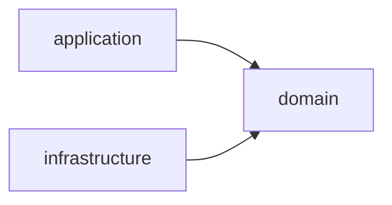

# CLAUDE.md

This file provides guidance to Claude Code (claude.ai/code) when working with code in this repository.

This is the `server/` module of conxugal — see the root `CLAUDE.md` for the repo-wide
spec-driven workflow (`SPEC → FEAT → TASK`). This module implements the backend
decided in `docs/architecture/0001-backend-stack.md` (Micronaut, Java 25, PostgreSQL,
REST) and `docs/architecture/0002-hexagonal-architecture.md` (the module split below).

## Commands

Run from `server/` (Gradle wrapper; Java 25 toolchain is pinned in the root
`build.gradle` and auto-provisioned by Gradle if not installed):

- `./gradlew build` — compile, run all tests (`check`) and assemble all three modules
- `./gradlew test` — run all tests without assembling
- `./gradlew :application:test` — run tests in a single module (`:domain:test`,
  `:infrastructure:test` likewise)
- `./gradlew test --tests "<FullyQualifiedTestName>"` — run a single test class (works
  across all modules; scope to one with e.g. `:application:test --tests ...`)
- `./gradlew run` — run the application (`application` module; embedded Netty server on
  port 8080, see `application/src/main/resources/application.yml`)
- `./gradlew :infrastructure:integrationTest` — run `infrastructure`'s integration
  tests (adapters against a real PostgreSQL, started disposably via Testcontainers —
  needs a Docker daemon). Defined as a
  [JVM Test Suite](https://docs.gradle.org/current/userguide/jvm_test_suite_plugin.html)
  (`infrastructure/src/integrationTest`) that is deliberately **not** added to `check`,
  same as `acceptance` (see below).

## Fast feedback while iterating

`./gradlew build`/`test` never runs `integrationTest` (it needs a Docker daemon and is
kept out of `check`, see above) — running only `test` after touching an adapter gives a
false green. Pick the narrowest command(s) that actually exercise what changed:

| What changed | Run for feedback |
| --- | --- |
| `domain/src/main/java/**` (entities, ports, use cases) | `./gradlew :domain:test` |
| `infrastructure/src/main/java/**` — a class implementing a `domain` port (an adapter: repository, encoder, client, …) | `./gradlew :infrastructure:test :infrastructure:integrationTest` — the unit suite alone doesn't touch the real dependency the adapter drives |
| `infrastructure/src/main/resources/db/migration/**` (schema/migrations) | `./gradlew :infrastructure:integrationTest` |
| `application/src/main/java/**` (REST endpoints, security config, wiring) | `./gradlew :application:test` |
| `acceptance/src/test/java/**` | Needs a running instance first (see below); then `./gradlew acceptance` |
| Any `build.gradle`, `gradle/libs.versions.toml`, or `settings.gradle` | `./gradlew build` (full multi-module build) |
| Before committing, regardless of scope | `./gradlew build` (see below) |

## Before committing

Run `./gradlew build` from `server/` and fix any failures before committing changes
to this module. If the change touched an `infrastructure` adapter, also run
`./gradlew :infrastructure:integrationTest` — `build` alone won't have exercised it.

## Architecture

Three-module hexagonal (ports & adapters) Gradle build (ADR-0002), wired only through
`settings.gradle` and Micronaut's DI container — there is no other cross-module glue:

- **`domain`** — the core model, business rules, and the *ports* (interfaces) the
  other two modules implement/drive. Depends on nothing else. Free of transport and
  persistence concerns, though domain classes may still carry Micronaut DI
  annotations.
- **`application`** — the *driving side*: REST endpoints, schedulers, other triggers,
  and the use-case orchestration that coordinates `domain`. This is also the runnable
  Micronaut application (composition root: `Application.java`, `mainClass` in
  `application/build.gradle`) and the single artifact that will serve the built UI
  (ADR-0003).
- **`infrastructure`** — the *driven side*: adapters implementing `domain` ports
  against external systems (PostgreSQL, scrapers/ingestors for
  contratosdegalicia.gal, exporters).

**The dependency rule is load-bearing and intentional, not incidental:**
`application` depends on `domain` only — `runtimeOnly(project(":infrastructure"))` in
`application/build.gradle` means infrastructure is assembled at *runtime only*, so
application code cannot compile against adapter types. `infrastructure` depends on
`domain` only and must never depend on `application`. The two outer modules meet
solely through domain ports and Micronaut's DI container at runtime — don't add a
compile-time edge between them. Domain types cross module boundaries directly; don't
add a DTO/mapping layer unless a concrete need arises (e.g. an external contract that
diverges from the domain shape).

Dependency versions are centralized in `gradle/libs.versions.toml`; most
`io.micronaut*` and driver versions are left unversioned there because the Micronaut
platform BOM (`micronautVersion` in `gradle.properties`) resolves them at build time —
bump that one property rather than pinning individual library versions.
