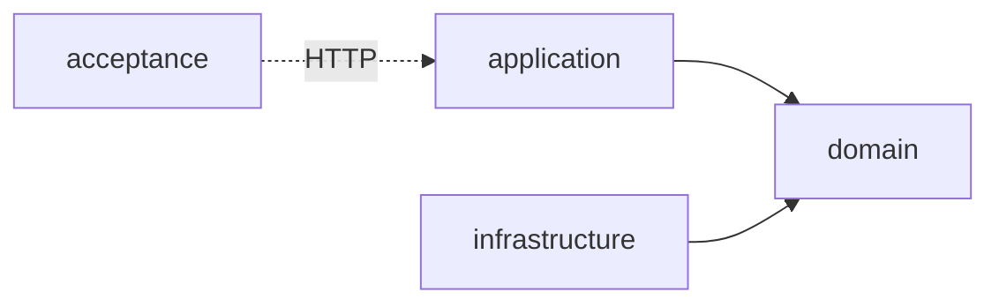

# conxugal — server

Backend de importación, almacenamento e consulta dos contratos públicos da Xunta de Galicia.

Multi-module **Micronaut** (Java 25) application following a hexagonal (ports &
adapters) architecture. It imports and stores the contract data in **PostgreSQL**,
exposes the query API, and serves the built UI as a single deployable artifact.

Governing decisions: [ADR-0001](../docs/architecture/0001-backend-stack.md) (Micronaut,
Java 25, PostgreSQL), [ADR-0002](../docs/architecture/0002-hexagonal-architecture.md)
(hexagonal module split) and [ADR-0007](../docs/architecture/0007-acceptance-testing-module.md)
(acceptance module).

## Requirements

- **Java 25** — the toolchain is pinned in `build.gradle.kts` and auto-provisioned by
  Gradle if not installed, so no manual JDK setup is required.
- **PostgreSQL** — the datastore ([ADR-0001](../docs/architecture/0001-backend-stack.md)).

## Getting started

```bash
./gradlew run     # start the app (embedded Netty on http://localhost:8080)
./gradlew build   # compile, run all tests (check) and assemble every module
```

## Commands

| Command | Description |
| --- | --- |
| `./gradlew run` | Run the application (`application` module, port 8080). |
| `./gradlew build` | Compile, run `check` and assemble all modules. |
| `./gradlew test` | Run all unit tests without assembling. |
| `./gradlew :application:test` | Run the unit tests of a single module (`:domain:test`, `:infrastructure:test` likewise). |
| `./gradlew :infrastructure:integrationTest` | Run `infrastructure`'s adapter tests against a real PostgreSQL (Testcontainers, needs Docker). Not part of `check`/`build`. |
| `./gradlew acceptance` | Run the black-box acceptance suite against an **already-running** instance (see below). |
| `docker compose --profile app up -d` | Run the packaged app (after `./gradlew :application:dockerBuild`) alongside Postgres and the WireMock standing in for contratosdegalicia.gal, for a local `./gradlew acceptance` run. |
| `../scripts/contract-test.sh` | Check the same already-running instance against [`docs/api/openapi.yaml`](../docs/api/openapi.yaml) with Schemathesis ([ADR-0021](../docs/architecture/0021-openapi-contract-testing-with-schemathesis.md)). Deterministic, on the pull-request gate's budget. Generates and deletes data, so point it only at a disposable instance. |
| `CONTRACT_TEST_SEED=<n> CONTRACT_TEST_MAX_EXAMPLES=<n> ../scripts/contract-test.sh` | The same check on the nightly fuzz settings — a named seed and a larger budget. Use it to replay a failure from [`contract-fuzz.yml`](../.github/workflows/contract-fuzz.yml), which prints the seed in its job summary. Restart the instance first: the run consumes the fixtures it deletes. |

## Structure

Three-module hexagonal build (ADR-0002), wired only through `settings.gradle.kts` and
Micronaut's DI container:



- **`domain`** — the core model, business rules and the *ports* (interfaces) the other
  modules implement. Depends on nothing else.
- **`application`** — the *driving side*: REST endpoints, schedulers and use-case
  orchestration. The runnable Micronaut app (composition root `Application.java`) and
  the artifact that serves the built UI ([ADR-0003](../docs/architecture/0003-react-router-ui-served-by-backend.md)).
- **`infrastructure`** — the *driven side*: adapters implementing `domain` ports against
  external systems (PostgreSQL, scrapers/ingestors for contratosdegalicia.gal, exporters).
  Assembled at runtime only, so `application` cannot compile against adapter types.
- **`acceptance`** — black-box tests ([ADR-0007](../docs/architecture/0007-acceptance-testing-module.md))
  that drive a genuinely running instance over HTTP. It has no compile dependency on the
  other modules and never boots the app itself: bring the instance (and its mocked
  downstreams) up first, then run `./gradlew acceptance`. Point it at a non-default
  instance with `-Dapp.baseUrl=…`.

## Access

Every route needs a session except `/login`, `/health` and `/assets/static-pages/**` (the
stylesheet the server-rendered pages load before a session exists); `/api/admin/**`
additionally needs the `ADMIN` role. Signing in is a server-rendered form at `/login`, outside the SPA
([ADR-0005](../docs/architecture/0005-session-based-authentication.md)) — the session
cookie it sets expires after 30 minutes of inactivity. Passwords are stored as Argon2id
hashes ([ADR-0024](../docs/architecture/0024-argon2id-password-hashing.md)). A request
without a valid session is redirected to `/login` if it asked for HTML and answered `401`
if it did not. `CLAUDE.md` documents the wiring.

**Every** environment's migrations seed an ADMIN account — `root@local` / `secret`
(`db/migration/V3__seed_default_admin_user.sql`), not just local and CI. Change or disable
it before any real deployment. The `local` profile adds a USER account on top,
`demo@local` / `demo` (`db/migration-local/V4__seed_demo_user.sql`).

## More

See [ADR-0002](../docs/architecture/0002-hexagonal-architecture.md) for the architecture
rationale and the dependency rule that keeps the modules decoupled, and the
[`docs/`](../docs) tree for the *spec → feature → task* workflow.

<!-- distilled-from: FEAT-0002 @ 6d8a9f4 -->
