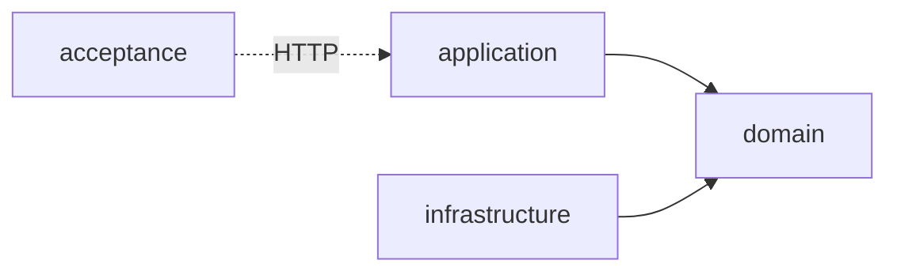

# conxugal — server

Backend de importación, almacenamento e consulta dos contratos públicos da Xunta de Galicia.

Multi-module **Micronaut** (Java 25) application following a hexagonal (ports &
adapters) architecture. It imports and stores the contract data in **PostgreSQL**,
exposes the query API, and serves the built UI as a single deployable artifact.

Governing decisions: [ADR-0001](../docs/architecture/0001-backend-stack.md) (Micronaut,
Java 25, PostgreSQL), [ADR-0002](../docs/architecture/0002-hexagonal-architecture.md)
(hexagonal module split) and [ADR-0007](../docs/architecture/0007-acceptance-testing-module.md)
(acceptance module).

## Requirements

- **Java 25** — the toolchain is pinned in `build.gradle.kts` and auto-provisioned by
  Gradle if not installed, so no manual JDK setup is required.
- **PostgreSQL** — the datastore ([ADR-0001](../docs/architecture/0001-backend-stack.md)).

## Getting started

```bash
./gradlew run     # start the app (embedded Netty on http://localhost:8080)
./gradlew build   # compile, run all tests (check) and assemble every module
```

## Commands

| Command | Description |
| --- | --- |
| `./gradlew run` | Run the application (`application` module, port 8080). |
| `./gradlew build` | Compile, run `check` and assemble all modules. |
| `./gradlew test` | Run all unit tests without assembling. |
| `./gradlew :application:test` | Run the unit tests of a single module (`:domain:test`, `:infrastructure:test` likewise). |
| `./gradlew :infrastructure:integrationTest` | Run `infrastructure`'s adapter tests against a real PostgreSQL (Testcontainers, needs Docker). Not part of `check`/`build`. |
| `./gradlew acceptance` | Run the black-box acceptance suite against an **already-running** instance (see below). |

## Structure

Three-module hexagonal build (ADR-0002), wired only through `settings.gradle.kts` and
Micronaut's DI container:



- **`domain`** — the core model, business rules and the *ports* (interfaces) the other
  modules implement. Depends on nothing else.
- **`application`** — the *driving side*: REST endpoints, schedulers and use-case
  orchestration. The runnable Micronaut app (composition root `Application.java`) and
  the artifact that serves the built UI ([ADR-0003](../docs/architecture/0003-react-router-ui-served-by-backend.md)).
- **`infrastructure`** — the *driven side*: adapters implementing `domain` ports against
  external systems (PostgreSQL, scrapers/ingestors for contratosdegalicia.gal, exporters).
  Assembled at runtime only, so `application` cannot compile against adapter types.
- **`acceptance`** — black-box tests ([ADR-0007](../docs/architecture/0007-acceptance-testing-module.md))
  that drive a genuinely running instance over HTTP. It has no compile dependency on the
  other modules and never boots the app itself: bring the instance (and its mocked
  downstreams) up first, then run `./gradlew acceptance`. Point it at a non-default
  instance with `-Dapp.baseUrl=…`.

## More

See [ADR-0002](../docs/architecture/0002-hexagonal-architecture.md) for the architecture
rationale and the dependency rule that keeps the modules decoupled, and the
[`docs/`](../docs) tree for the *spec → feature → task* workflow.
